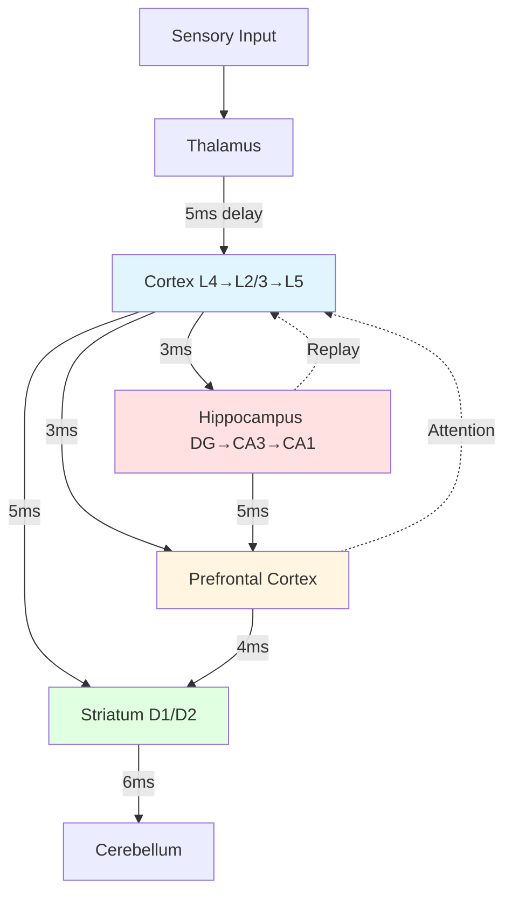

# THALIA

> **Th**inking **A**rchitecture via **L**earning **I**ntegrated **A**ttractors

*"She who flourishes"* — Greek Muse of spontaneous thought

A framework for building genuinely thinking spiking neural networks that generate thoughts through recurrent dynamics, form concept attractors, and achieve spontaneous cognition.

## Vision

Create an SNN-based architecture where **thinking is not input→output processing, but the network talking to itself** — recurrent dynamics that generate, test, and evolve thoughts spontaneously.

## Core Principles

1. **Thoughts as Dynamical Attractors** — Stable patterns of neural activity representing concepts
2. **Temporal Dynamics** — Spike timing matters, not just rates
3. **Hierarchical Time Constants** — Fast sensory, slow abstract layers
4. **Self-Referential Processing** — Output feeds back as input
5. **Embodied Grounding** — Concepts emerge from sensorimotor patterns

## Installation

```bash
# Clone the repository
git clone https://github.com/username/thalia.git
cd thalia

# Install in development mode
pip install -e ".[dev]"

# Or with experiment dependencies
pip install -e ".[all]"
```

## Quick Start

```python
from thalia.config import ThaliaConfig
from thalia.core.brain import EventDrivenBrain

# Initialize brain with default configuration
config = ThaliaConfig()
brain = EventDrivenBrain.from_thalia_config(config)

# Process sensory input
import torch
visual_input = torch.rand(784, dtype=torch.float32)  # 28x28 image
output = brain.forward(visual_input=visual_input)

# Select action
action, value = brain.select_action(explore=True)
brain.deliver_reward(reward=1.0)
```

## Architecture Overview



**Key Features:**
- **Spiking Pathways**: All connections use LIF neurons with axonal delays
- **Learning Rules**: STDP, BCM, Hebbian, dopamine-modulated plasticity
- **Neuromodulation**: DA (reward), ACh (attention), NE (arousal)
- **Temporal Dynamics**: Theta/alpha/gamma oscillations coordinate processing

## Documentation

- **[Documentation Hub](docs/README.md)** — Complete documentation overview
- **[Contributing Guide](CONTRIBUTING.md)** — How to add regions, learning rules, tests
- [Architecture](docs/architecture/) — System design and complexity layers
- [Design Specs](docs/design/) — Checkpoint format, curriculum strategy, neuron models
- [Implementation Patterns](docs/patterns/) — Configuration, state management, mixins
- [Architecture Decisions](docs/decisions/) — ADRs for key technical choices

## Contributing

We welcome contributions! Please see [CONTRIBUTING.md](CONTRIBUTING.md) for:
- How to add a new brain region
- How to implement a new learning rule
- Testing guidelines
- Code style and biological plausibility constraints

## License

MIT License — see [LICENSE](LICENSE) for details.
