# THALIA

> **Th**inking **A**rchitecture via **L**earning **I**ntegrated **A**ttractors

*"She who flourishes"* — Greek Muse of spontaneous thought

A framework for building genuinely thinking spiking neural networks that generate thoughts through recurrent dynamics, form concept attractors, and achieve spontaneous cognition.

## Vision

Create an SNN-based architecture where **thinking is not input→output processing, but the network talking to itself** — recurrent dynamics that generate, test, and evolve thoughts spontaneously.

## Core Principles

1. **Thoughts as Dynamical Attractors** — Stable patterns of neural activity representing concepts
2. **Temporal Dynamics** — Spike timing matters, not just rates
3. **Hierarchical Time Constants** — Fast sensory, slow abstract layers
4. **Self-Referential Processing** — Output feeds back as input
5. **Embodied Grounding** — Concepts emerge from sensorimotor patterns

## Installation

```bash
# Clone the repository
git clone https://github.com/username/thalia.git
cd thalia

# Install in development mode
pip install -e ".[dev]"

# Or with experiment dependencies
pip install -e ".[all]"
```

## Quick Start

```python
from thalia.config import BrainConfig
from thalia.core.dynamic_brain import DynamicBrain, BrainBuilder
import torch

# Use preset architectures
brain_config = BrainConfig(device="cpu", dt_ms=1.0)
brain = BrainBuilder.preset("default", brain_config)

# Process sensory input (encoding phase)
visual_input = torch.rand(784, dtype=torch.float32)
output = brain.forward(sensory_input=visual_input, n_timesteps=15)

# Access regions by name (component-based architecture)
cortex = brain.components["cortex"]  # NeuralRegion instance
hippocampus = brain.components["hippocampus"]
axonal_projection = brain.connections[("thalamus", "cortex")]  # AxonalProjection

# Select action (decision-making)
action, confidence = brain.select_action(explore=True)

# Deliver reward (reinforcement learning via three-factor rule)
brain.deliver_reward(external_reward=1.0)
```

## Architecture Overview

```mermaid
graph TD
    A[Sensory Input] --> B[Thalamus]
    B -->|5ms delay| C[Cortex L4→L2/3→L5→L6a/L6b]
    C -->|3ms| D[Hippocampus DG→CA3→CA1]
    C -->|5ms| E[Striatum D1/D2]
    C -->|3ms| F[Prefrontal Cortex]
    D -->|5ms| F
    F -->|4ms| E
    E -->|6ms| G[Cerebellum]
    F -.->|Attention| C
    D -.->|Replay| C
    C -.->|L6a TRN| B
    C -.->|L6b Relay| B

    style C fill:#e1f5ff
    style D fill:#ffe1e1
    style E fill:#e1ffe1
    style F fill:#fff5e1
```



**Key Features:**
- **v3.0 Architecture**: NeuralRegion base class (nn.Module + mixins)
- **Flexible Construction**: Component-based brain built with `BrainBuilder` or from configuration
- **Synapses at Dendrites**: Weights stored at target regions (`synaptic_weights` dict), not in pathways
- **Learning Strategies**: Pluggable learning rules (STDP, BCM, Hebbian, three-factor, error-corrective)
- **Axonal Delays**: Realistic conduction delays (1-20ms) via `CircularDelayBuffer` in `AxonalProjection`
- **Clock-Driven Execution**: Fixed timestep simulation with temporal dynamics
- **Neuromodulation**: Dopamine, norepinephrine, acetylcholine gate learning
- **Multi-Source Integration**: Regions receive `Dict[str, Tensor]` from multiple sources
- **Component Parity**: Regions and pathways treated equally in graph architecture
- **Axonal Projections**: Pure spike routing with realistic conduction delays via `CircularDelayBuffer`
- **Spiking Neurons**: ConductanceLIF neurons (ONLY neuron model) with conductance-based dynamics
- **Learning Rules**: STDP, BCM, Hebbian, three-factor (dopamine-modulated) at target synapses
- **Neuromodulation**: Dopamine (reward), acetylcholine (encoding/retrieval), norepinephrine (arousal)
- **Temporal Coordination**: Theta (8Hz), alpha (10Hz), gamma (40Hz) oscillations with cross-frequency coupling
- **Planning Systems**: TD(λ) credit assignment, Dyna-style planning, hierarchical goals
- **Memory Systems**: One-shot episodic (hippocampus), working memory (PFC), procedural (striatum)
- **Circuit Modeling**: Laminar cortex (L4→L2/3→L5, L6a/L6b corticothalamic), trisynaptic hippocampus (DG→CA3→CA1), D1/D2 striatal pathways
- **Clock-Driven Execution**: Regular timesteps (1ms) with biologically accurate axonal delays (1-20ms)

## Documentation

### Getting Started
- **[Documentation Hub](docs/README.md)** — Complete documentation overview
- **[Getting Started Guide](docs/GETTING_STARTED_CURRICULUM.md)** — Curriculum training tutorial
- **[Contributing Guide](CONTRIBUTING.md)** — How to add regions, learning rules, tests

### Reference Documentation
- **[Architecture](docs/architecture/)** — System design, 5-level complexity hierarchy, component index
- **[Design Specs](docs/design/)** — Checkpoint format, curriculum strategy, neuron models, circuit timing
- **[Implementation Patterns](docs/patterns/)** — Learning strategies, state management, mixins, component parity
- **[Architecture Decisions](docs/decisions/)** — ADRs documenting key technical choices

### Quick References
- [Curriculum Training](docs/CURRICULUM_QUICK_REFERENCE.md) — API reference for training pipeline
- [Datasets](docs/DATASETS_QUICK_REFERENCE.md) — Stage-specific datasets (temporal, CIFAR, grammar, reading)
- [Monitoring](docs/MONITORING_GUIDE.md) — Health checks, training visualization, diagnostics

## Project Status

**Current Version**: 0.1.0 (Pre-Alpha)
**Status**: Active Development

### Implemented Features ✅
- **Core Architecture**:
  - Brain regions: Cortex (6-layer L4→L2/3→L5→L6a/L6b), Hippocampus (DG→CA3→CA1), Striatum (D1/D2 pathways), PFC, Cerebellum (with gap junctions), Thalamus
  - AxonalProjection: Pure spike routing with CircularDelayBuffer delays
  - NeuralRegion: Base class with synaptic_weights dict at dendrites
- **Learning & Plasticity**:
  - Learning strategies: STDP, BCM, Hebbian, three-factor (eligibility × dopamine)
  - Per-source learning: Different rules for different inputs
  - Strategy pattern: Pluggable, composable learning algorithms
  - Cerebellum: Per-Purkinje dendritic learning with LTD/LTP mechanisms
- **Biological Circuits** (December 2025):
  - Striatum D1/D2 delays: 15ms (Go) vs 25ms (No-Go) temporal competition
  - Thalamus-Cortex-TRN loop: Dual L6a/L6b feedback with attention gating
  - Cerebellum gap junctions: IO neuron synchronization (<1ms coupling) for coordinated learning
  - Cortical laminar delays: L4→L2/3→L5 microcircuit with proper timing
- **Neuromodulation**:
  - Three systems: VTA (dopamine), LC (norepinephrine), NB (acetylcholine)
  - Centralized management with biological coordination
- **Temporal Coordination**:
  - Five brain rhythms: Delta (2Hz), Theta (8Hz), Alpha (10Hz), Beta (20Hz), Gamma (40Hz)
  - Cross-frequency coupling (theta-gamma, beta-gamma, etc.)
- **Planning & Memory**:
  - TD(λ) for multi-step credit assignment
  - Dyna planning (model-based)
  - Hierarchical goal management
  - Working memory (PFC gating)
  - Episodic memory (hippocampal one-shot learning)
- **Training Infrastructure**:
  - Curriculum training pipeline (Stages -0.5 through 4)
  - Checkpoint system (PyTorch format + optional binary)
  - Stage-specific datasets: Temporal, Phonology, CIFAR-10, Grammar, Reading
  - Multilingual support (English, German, Spanish)
- **Diagnostics & Monitoring**:
  - HealthMonitor: Runtime pathology detection
  - CriticalityMonitor: Branching ratio tracking
  - MetacognitiveMonitor: Confidence estimation
  - TrainingMonitor: Post-hoc analysis and visualization

### In Progress 🔄
- Stage 0 validation (sensory foundations)
- Performance benchmarking
- API stabilization

### Planned 📋
- Stages 5-6 (expert-level, LLM-level capabilities)
- GPU optimization for large-scale networks
- Neuromorphic hardware support
- Interactive visualization dashboard

## Contributing

We welcome contributions! Please see [CONTRIBUTING.md](CONTRIBUTING.md) for:
- How to add a new brain region
- How to implement a new learning rule
- Testing guidelines
- Code style and biological plausibility constraints

## License

MIT License — see [LICENSE](LICENSE) for details.
