# THALIA

> **Th**inking **A**rchitecture via **L**earning **I**ntegrated **A**ttractors

*"She who flourishes"* — Greek Muse of spontaneous thought

A framework for building genuinely thinking spiking neural networks that generate thoughts through recurrent dynamics, form concept attractors, and achieve spontaneous cognition.

## Vision

Create an SNN-based architecture where **thinking is not input→output processing, but the network talking to itself** — recurrent dynamics that generate, test, and evolve thoughts spontaneously.

## Core Principles

1. **Thoughts as Dynamical Attractors** — Stable patterns of neural activity representing concepts
2. **Temporal Dynamics** — Spike timing matters, not just rates
3. **Hierarchical Time Constants** — Fast sensory, slow abstract layers
4. **Self-Referential Processing** — Output feeds back as input
5. **Embodied Grounding** — Concepts emerge from sensorimotor patterns

## Installation

```bash
# Clone the repository
git clone https://github.com/username/thalia.git
cd thalia

# Install in development mode
pip install -e ".[dev]"

# Or with experiment dependencies
pip install -e ".[all]"
```

## Quick Start

```python
from thalia.config import ThaliaConfig, GlobalConfig, BrainConfig, RegionSizes
from thalia.core.dynamic_brain import DynamicBrain, BrainBuilder
import torch

# Option 1: Use preset architectures
global_config = GlobalConfig(device="cpu", dt_ms=1.0)
brain = BrainBuilder.preset("sensorimotor", global_config)

# Option 2: Build from configuration
config = ThaliaConfig(
    global_=GlobalConfig(device="cpu", dt_ms=1.0),
    brain=BrainConfig(
        sizes=RegionSizes(
            input_size=784,      # 28x28 MNIST
            cortex_size=1000,
            hippocampus_size=500,
            pfc_size=200,
            n_actions=10,
        ),
    ),
)
brain = DynamicBrain.from_thalia_config(config)

# Process sensory input (encoding phase)
visual_input = torch.rand(784, dtype=torch.float32)
output = brain.forward(sensory_input=visual_input, n_timesteps=15)

# Access regions by name
cortex = brain.components["cortex"]
hippocampus = brain.components["hippocampus"]

# Select action (decision-making)
action, confidence = brain.select_action(explore=True)

# Deliver reward (reinforcement learning)
brain.deliver_reward(external_reward=1.0)
```

## Architecture Overview

```mermaid
graph TD
    A[Sensory Input] --> B[Thalamus]
    B -->|5ms delay| C[Cortex L4→L2/3→L5]
    C -->|3ms| D[Hippocampus DG→CA3→CA1]
    C -->|5ms| E[Striatum D1/D2]
    C -->|3ms| F[Prefrontal Cortex]
    D -->|5ms| F
    F -->|4ms| E
    E -->|6ms| G[Cerebellum]
    F -.->|Attention| C
    D -.->|Replay| C

    style C fill:#e1f5ff
    style D fill:#ffe1e1
    style E fill:#e1ffe1
    style F fill:#fff5e1
```



**Key Features:**
- **Flexible Architecture**: Component-based brain built with `BrainBuilder` or from configuration
- **Spiking Pathways**: ConductanceLIF neurons with realistic axonal delays (2-8ms)
- **Learning Rules**: STDP, BCM, Hebbian, three-factor (dopamine-modulated)
- **Neuromodulation**: Dopamine (reward), acetylcholine (encoding/retrieval), norepinephrine (arousal)
- **Temporal Coordination**: Theta (8Hz), alpha (10Hz), gamma (40Hz) oscillations
- **Planning Systems**: TD(λ) credit assignment, Dyna-style planning, hierarchical goals
- **Memory Systems**: One-shot episodic (hippocampus), working memory (PFC), procedural (striatum)
- **Circuit Modeling**: Laminar cortex (L4→L2/3→L5), trisynaptic hippocampus (DG→CA3→CA1), D1/D2 striatal pathways

## Documentation

### Getting Started
- **[Documentation Hub](docs/README.md)** — Complete documentation overview
- **[Getting Started Guide](docs/GETTING_STARTED_CURRICULUM.md)** — Curriculum training tutorial
- **[Contributing Guide](CONTRIBUTING.md)** — How to add regions, learning rules, tests

### Reference Documentation
- **[Architecture](docs/architecture/)** — System design, 5-level complexity hierarchy, component index
- **[Design Specs](docs/design/)** — Checkpoint format, curriculum strategy, neuron models, circuit timing
- **[Implementation Patterns](docs/patterns/)** — Learning strategies, state management, mixins, component parity
- **[Architecture Decisions](docs/decisions/)** — ADRs documenting key technical choices

### Quick References
- [Curriculum Training](docs/CURRICULUM_QUICK_REFERENCE.md) — API reference for training pipeline
- [Datasets](docs/DATASETS_QUICK_REFERENCE.md) — Stage-specific datasets (temporal, CIFAR, grammar, reading)
- [Monitoring](docs/MONITORING_GUIDE.md) — Health checks, training visualization, diagnostics

## Project Status

**Current Version**: 0.1.0 (Pre-Alpha)
**Status**: Active Development

### Implemented Features ✅
- Core brain regions (Cortex, Hippocampus, Striatum, PFC, Cerebellum, Thalamus)
- Flexible component-based architecture (DynamicBrain with BrainBuilder)
- Learning strategies (STDP, BCM, Hebbian, three-factor)
- Neuromodulator systems (dopamine, acetylcholine, norepinephrine)
- Planning systems (TD(λ), Dyna, hierarchical goals)
- Curriculum training pipeline (Stages -0.5 through 4)
- Checkpoint system (PyTorch format + optional binary format)
- Parallel execution (multi-core CPU)
- Comprehensive diagnostics and monitoring

### In Progress 🔄
- Stage 0 validation (sensory foundations)
- Performance benchmarking
- API stabilization

### Planned 📋
- Stages 5-6 (expert-level, LLM-level capabilities)
- GPU optimization for large-scale networks
- Neuromorphic hardware support
- Interactive visualization dashboard

## Contributing

We welcome contributions! Please see [CONTRIBUTING.md](CONTRIBUTING.md) for:
- How to add a new brain region
- How to implement a new learning rule
- Testing guidelines
- Code style and biological plausibility constraints

## License

MIT License — see [LICENSE](LICENSE) for details.
