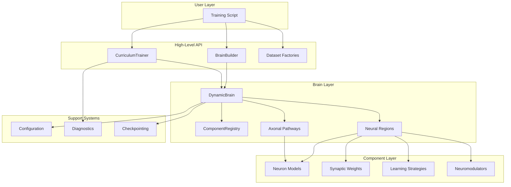
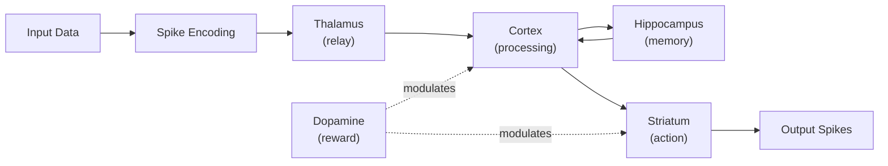
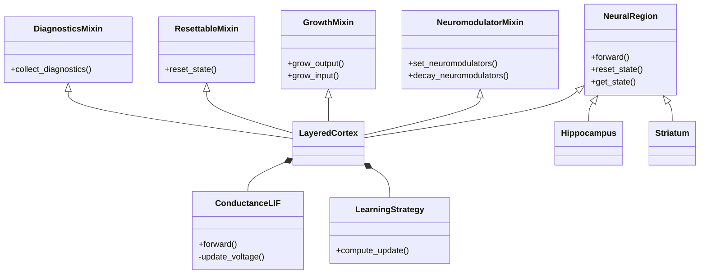
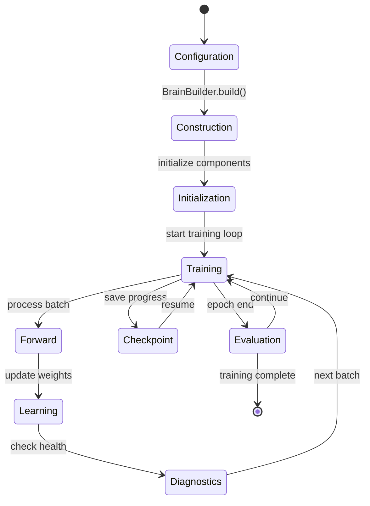
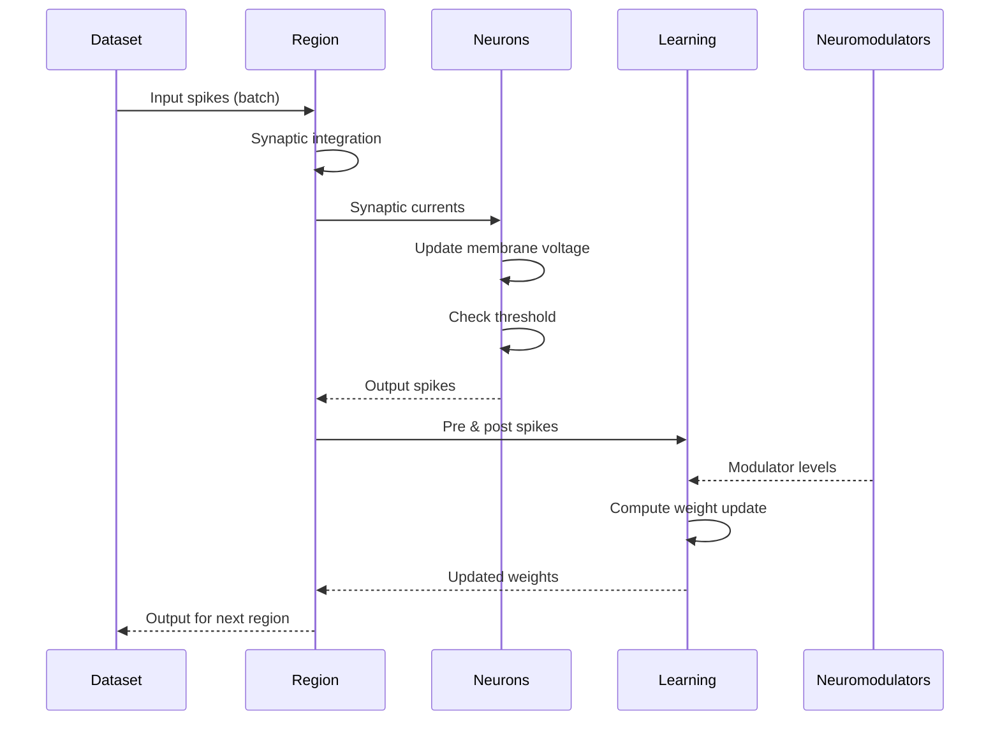
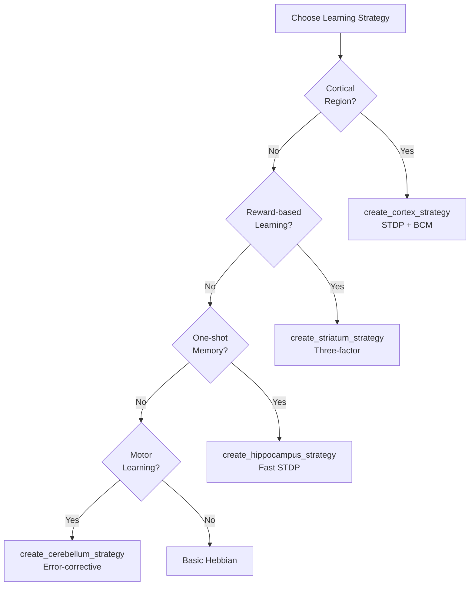
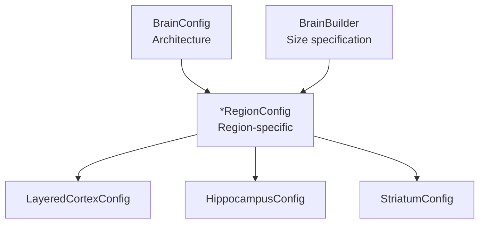

# Architecture Guide

> **Auto-generated documentation** - Do not edit manually!
> Last updated: 2026-01-26 13:45:45
> Generated from: `scripts/generate_api_docs.py`

This guide provides architectural diagrams and design patterns for the Thalia framework.

## 🏗️ System Architecture Overview

## 📊 Data Flow Architecture

## 🧩 Component Composition Pattern

## ⏰ Brain Lifecycle

## ⚡ Spike Processing Pipeline

## 🎓 Learning Strategy Selection

## ⚙️ Configuration Hierarchy

**Note**: Region sizes are specified directly in BrainBuilder.add_component() calls.

## 💡 Architectural Best Practices

### Design Principles

1. **Biological Plausibility**: All designs follow neuroscience principles
2. **Local Learning**: No global error signals or backpropagation
3. **Spike-Based**: Binary spikes, not firing rates
4. **Modular Composition**: Regions are independent, composable units
5. **Mixins for Cross-Cutting**: Common functionality via mixins

### Component Guidelines

- **Regions**: Inherit from `NeuralRegion`, use standard mixins
- **Pathways**: Pure spike routing, no learning
- **Learning**: Implement `LearningStrategy` protocol
- **Configs**: Pure dataclasses, no logic
- **Neurons**: Only `ConductanceLIF` model used

### Growth Strategy

1. Start with small networks (64-256 neurons per region)
2. Train on Stage 0 (temporal sequences)
3. Grow network based on curriculum needs
4. Add new regions via `ComponentRegistry`
5. Use dynamic weight initialization

## 📚 Related Documentation

- [COMPONENT_CATALOG.md](COMPONENT_CATALOG.md) - All available regions and pathways
- [DEPENDENCY_GRAPH.md](DEPENDENCY_GRAPH.md) - Module dependency structure
- [LEARNING_STRATEGIES_API.md](LEARNING_STRATEGIES_API.md) - Learning rule selection
- [API_INDEX.md](API_INDEX.md) - Complete component index

