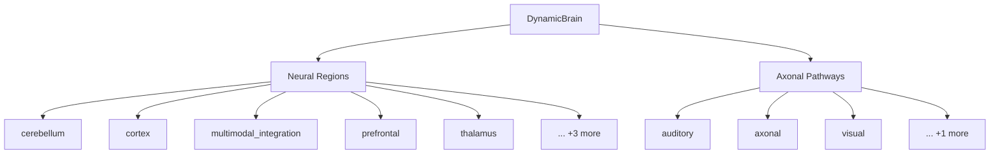

# Component Catalog

> **Auto-generated documentation** - Do not edit manually!
> Last updated: 2025-12-31 19:33:39
> Generated from: `scripts/generate_api_docs.py`

  

This document catalogs all registered brain regions and pathways in the Thalia component registry.

## 📊 Statistics

| Metric | Count |
|--------|-------|
| **Total Regions** | 8 |
| **Total Pathways** | 4 |
| **Regions with Custom Config** | 7 |
| **Components with Aliases** | 7 |

## ⚡ Performance Metrics

**Full Forward Pass (1 timestep)**:

| Metric | Value |
|--------|-------|
| Mean | 218.90 ms |
| Median | 232.79 ms |
| P95 | 287.69 ms |
| Min | 154.78 ms |
| Max | 305.53 ms |

**Component Implementation Complexity**:

| Component | Type | Lines | Functions | Classes | Complexity |
|-----------|------|-------|-----------|---------|------------|
| **REGIONS** | | | | | |
| `prefrontal` | Region | 1284 | 30 | 4 | 56 |
| `cerebellum_region` | Region | 1389 | 31 | 4 | 54 |
| `multisensory` | Region | 1088 | 14 | 2 | 49 |
| `thalamus` | Region | 1404 | 26 | 3 | 48 |
| `prefrontal_hierarchy` | Region | 557 | 21 | 6 | 40 |
| *...+4 more* | | | | | |
| **PATHWAYS** | | | | | |
| `sensory_pathways` | Pathway | 1091 | 34 | 12 | 37 |
| `dynamic_manager` | Pathway | 235 | 7 | 1 | 31 |
| `axonal_projection` | Pathway | 417 | 16 | 2 | 20 |
| *...+1 more* | | | | | |

*Generated by: `scripts/profile_components.py`*

## 🧪 Test Coverage

**Overall Test Statistics**:

| Metric | Value |
|--------|-------|
| Total Components | 28 |
| Components with Tests | 14 (50.0%) |
| Total Test Functions | 711 |
| Average Coverage | 0.0% |
| Components with Edge Case Tests | 9 |
| Components with Integration Tests | 5 |

**Well-Tested Components** (50+ tests OR edge+integration tests):

- `brain_builder`: [142 tests](../../tests/unit/core/test_brain_builder.py) 🎯Edge 🔗Integration
- `dynamic_brain`: [142 tests](../../tests/unit/core/test_dynamic_brain.py) 🎯Edge
- `axonal_projection`: [95 tests](../../tests/unit/pathways/test_axonal_projection.py) 🎯Edge 🔗Integration
- `thalamus`: [91 tests](../../tests/unit/regions/test_thalamus.py) 🎯Edge 🔗Integration
- `prefrontal`: [52 tests](../../tests/unit/regions/test_prefrontal.py) 🎯Edge 🔗Integration

**Components Needing Tests** (14 components):

Click to expand list

- `diagnostics_keys` (core)
- `diagnostics_schema` (core)
- `region_components` (core)
- `ei_balance` (learning)
- `social_learning` (learning)
- `strategy_mixin` (learning)
- `strategy_registry` (learning)
- `dynamic_pathway_manager` (pathways)
- `protocol` (pathways)
- `sensory_pathways` (pathways)
- `base` (regions)
- `factory` (regions)
- `prefrontal_hierarchy` (regions)
- `stimulus_gating` (regions)

📋 <b>Detailed Coverage by Component Type</b> (click to expand)

| Component | Tests | Coverage | Edge Cases | Integration |
|-----------|-------|----------|------------|-------------|
| **REGIONS** | | | | |
| `base` | 0 | - | ✗ | ✗ |
| `cerebellum_region` | [23](../../tests/unit/regions/test_cerebellum_region.py) | - | ✓ | ✗ |
| `factory` | 0 | - | ✗ | ✗ |
| `multisensory` | [11](../../tests/unit/regions/test_multisensory.py) | - | ✗ | ✓ |
| `prefrontal` | [52](../../tests/unit/regions/test_prefrontal.py) | - | ✓ | ✓ |
| `prefrontal_checkpoint_manager` | [9](../../tests/unit/regions/test_prefrontal_checkpoint_manager.py) | - | ✗ | ✗ |
| `prefrontal_hierarchy` | 0 | - | ✗ | ✗ |
| `stimulus_gating` | 0 | - | ✗ | ✗ |
| `thalamus` | [91](../../tests/unit/regions/test_thalamus.py) | - | ✓ | ✓ |
| **PATHWAYS** | | | | |
| `axonal_projection` | [95](../../tests/unit/pathways/test_axonal_projection.py) | - | ✓ | ✓ |
| `dynamic_pathway_manager` | 0 | - | ✗ | ✗ |
| `protocol` | 0 | - | ✗ | ✗ |
| `sensory_pathways` | 0 | - | ✗ | ✗ |
| **CORE** | | | | |
| `brain_builder` | [142](../../tests/unit/core/test_brain_builder.py) | - | ✓ | ✓ |
| `diagnostics` | [14](../../tests/unit/core/test_diagnostics.py) | - | ✗ | ✗ |
| `diagnostics_keys` | 0 | - | ✗ | ✗ |
| `diagnostics_schema` | 0 | - | ✗ | ✗ |
| `dynamic_brain` | [142](../../tests/unit/core/test_dynamic_brain.py) | - | ✓ | ✗ |
| `errors` | [36](../../tests/unit/core/test_errors.py) | - | ✓ | ✗ |
| `neural_region` | [17](../../tests/unit/core/test_neural_region.py) | - | ✓ | ✗ |
| `pathway_state` | [13](../../tests/unit/core/test_pathway_state.py) | - | ✗ | ✗ |
| `region_components` | 0 | - | ✗ | ✗ |
| `region_state` | [49](../../tests/unit/core/test_region_state.py) | - | ✓ | ✗ |
| **LEARNING** | | | | |
| `critical_periods` | [17](../../tests/unit/learning/test_critical_periods.py) | - | ✗ | ✗ |
| `ei_balance` | 0 | - | ✗ | ✗ |
| `social_learning` | 0 | - | ✗ | ✗ |
| `strategy_mixin` | 0 | - | ✗ | ✗ |
| `strategy_registry` | 0 | - | ✗ | ✗ |

*Generated by: `scripts/analyze_coverage.py`*

> **Note**: Coverage percentages show 0% because pytest timed out during execution. Test counts and quality indicators (edge cases, integration tests) are accurate.

## 🧩 Component Hierarchy

## 📑 Contents

- [Registered Regions](#registered-regions)
- [Registered Pathways](#registered-pathways)

## Registered Regions

Total: **8** regions

### `cerebellum`

**Class**: [`Cerebellum`](../../src/thalia/regions/cerebellum_region.py#L460)

**Config Class**: [`CerebellumConfig`](../../src/thalia/regions/cerebellum_region.py#L104)

**Source**: [`thalia/regions/cerebellum_region.py`](../../src/thalia/regions/cerebellum_region.py)

**Description**: Cerebellar region with supervised error-corrective learning.

---

### `cortex`

**Class**: [`LayeredCortex`](../../src/thalia/regions/cortex/layered_cortex.py#L150)

**Aliases**: `layered_cortex`

**Config Class**: [`LayeredCortexConfig`](../../src/thalia/regions/cortex/config.py#L27)

**Source**: [`thalia/regions/cortex/layered_cortex.py`](../../src/thalia/regions/cortex/layered_cortex.py)

**Description**: Multi-layer cortical microcircuit with proper layer separation and routing.

---

### `hippocampus`

**Class**: [`TrisynapticHippocampus`](../../src/thalia/regions/hippocampus/trisynaptic.py#L137)

**Aliases**: `trisynaptic, trisynaptic_hippocampus`

**Config Class**: [`HippocampusConfig`](../../src/thalia/regions/hippocampus/config.py#L52)

**Source**: [`thalia/regions/hippocampus/trisynaptic.py`](../../src/thalia/regions/hippocampus/trisynaptic.py)

**Description**: Biologically-accurate hippocampus with DG→CA3→CA1 trisynaptic circuit.

---

### `multimodal_integration`

**Class**: [`MultimodalIntegration`](../../src/thalia/regions/multisensory.py#L168)

**Aliases**: `multimodal`

**Config Class**: `None`

**Source**: [`thalia/regions/multisensory.py`](../../src/thalia/regions/multisensory.py)

**Description**: Multimodal integration region for cross-modal fusion.

---

### `predictive_cortex`

**Class**: [`PredictiveCortex`](../../src/thalia/regions/cortex/predictive_cortex.py#L153)

**Aliases**: `predictive`

**Config Class**: [`PredictiveCortexConfig`](../../src/thalia/regions/cortex/predictive_cortex.py#L94)

**Source**: [`thalia/regions/cortex/predictive_cortex.py`](../../src/thalia/regions/cortex/predictive_cortex.py)

**Description**: Layered cortex with integrated predictive coding.

---

### `prefrontal`

**Class**: [`Prefrontal`](../../src/thalia/regions/prefrontal.py#L366)

**Aliases**: `pfc`

**Config Class**: [`PrefrontalConfig`](../../src/thalia/regions/prefrontal.py#L102)

**Source**: [`thalia/regions/prefrontal.py`](../../src/thalia/regions/prefrontal.py)

**Description**: Prefrontal cortex with dopamine-gated working memory.

---

### `striatum`

**Class**: [`Striatum`](../../src/thalia/regions/striatum/striatum.py#L153)

**Aliases**: `basal_ganglia`

**Config Class**: [`StriatumConfig`](../../src/thalia/regions/striatum/config.py#L23)

**Source**: [`thalia/regions/striatum/striatum.py`](../../src/thalia/regions/striatum/striatum.py)

**Description**: Striatal region with three-factor reinforcement learning.

---

### `thalamus`

**Class**: [`ThalamicRelay`](../../src/thalia/regions/thalamus.py#L372)

**Aliases**: `thalamic_relay`

**Config Class**: [`ThalamicRelayConfig`](../../src/thalia/regions/thalamus.py#L134)

**Source**: [`thalia/regions/thalamus.py`](../../src/thalia/regions/thalamus.py)

**Description**: Thalamic relay nucleus with burst/tonic modes and attentional gating.

---

## Registered Pathways

Total: **4** pathways

### `auditory`

**Class**: [`AuditoryPathway`](../../src/thalia/pathways/sensory_pathways.py#L735)

**Aliases**: `auditory_pathway, cochlear_pathway`

**Config Class**: `None`

**Source**: [`thalia/pathways/sensory_pathways.py`](../../src/thalia/pathways/sensory_pathways.py)

**Description**: Complete auditory pathway from audio to cortical input.

---

### `axonal`

**Class**: [`AxonalProjection`](../../src/thalia/pathways/axonal_projection.py#L81)

**Aliases**: `axonal_projection, pure_axon`

**Config Class**: `None`

**Source**: [`thalia/pathways/axonal_projection.py`](../../src/thalia/pathways/axonal_projection.py)

**Description**: Pure axonal transmission between brain regions.

---

### `language`

**Class**: [`LanguagePathway`](../../src/thalia/pathways/sensory_pathways.py#L801)

**Aliases**: `language_pathway, linguistic_pathway`

**Config Class**: `None`

**Source**: [`thalia/pathways/sensory_pathways.py`](../../src/thalia/pathways/sensory_pathways.py)

**Description**: Language pathway for text/token input using temporal/latency coding.

---

### `visual`

**Class**: [`VisualPathway`](../../src/thalia/pathways/sensory_pathways.py#L487)

**Aliases**: `visual_pathway, retinal_pathway`

**Config Class**: `None`

**Source**: [`thalia/pathways/sensory_pathways.py`](../../src/thalia/pathways/sensory_pathways.py)

**Description**: Complete visual pathway from image to cortical input.

---

## See Also

- [CONFIGURATION_REFERENCE.md](CONFIGURATION_REFERENCE.md) - Configuration classes for components
- [CONSTANTS_REFERENCE.md](CONSTANTS_REFERENCE.md) - Biological constants used by components
- [NEURON_FACTORIES_REFERENCE.md](NEURON_FACTORIES_REFERENCE.md) - Neuron populations used by regions
- [LEARNING_STRATEGIES_API.md](LEARNING_STRATEGIES_API.md) - Learning rules used by components
- [STATE_CLASSES_REFERENCE.md](STATE_CLASSES_REFERENCE.md) - State classes for checkpointing

