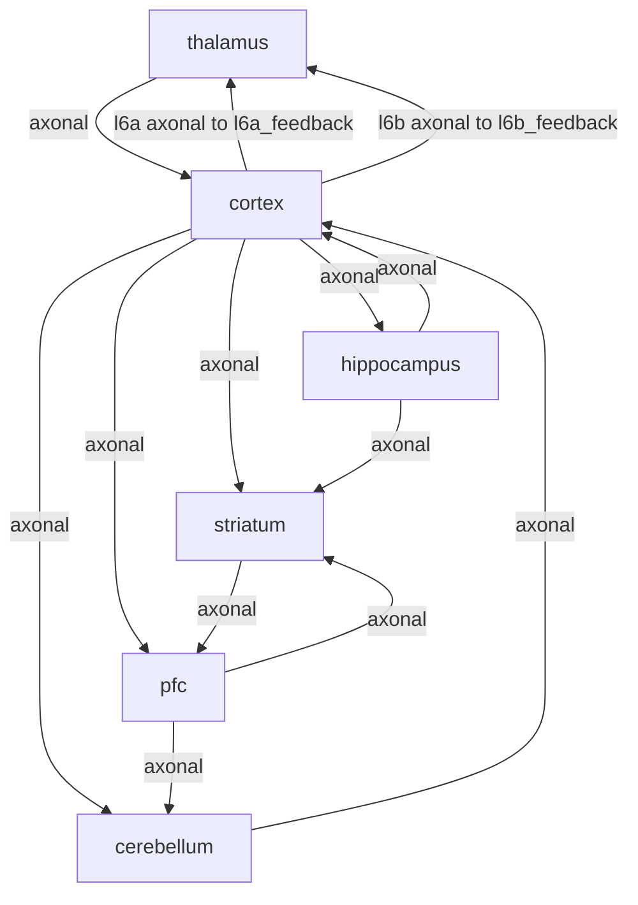
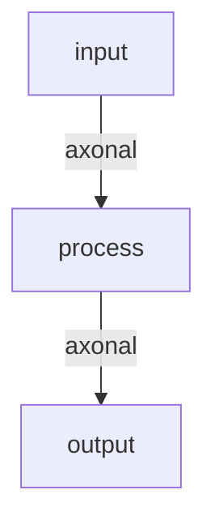

# Component Relationships

> **Auto-generated documentation** - Do not edit manually!
> Last updated: 2025-12-22 20:11:04
> Generated from: `scripts/generate_api_docs.py`

This document shows how components connect in preset brain architectures.

Total: 2 preset architectures

## Preset: `default`

**Components**: 6

**Connections**: 13

### Connections

| Source | Source Port | → | Target | Target Port | Pathway Type |
|--------|-------------|---|--------|-------------|-------------|
| `thalamus` | `default` | → | `cortex` | `default` | `axonal` |
| `cortex` | `l6a` | → | `thalamus` | `l6a_feedback` | `axonal` |
| `cortex` | `l6b` | → | `thalamus` | `l6b_feedback` | `axonal` |
| `cortex` | `default` | → | `hippocampus` | `default` | `axonal` |
| `hippocampus` | `default` | → | `cortex` | `default` | `axonal` |
| `cortex` | `default` | → | `pfc` | `default` | `axonal` |
| `cortex` | `default` | → | `striatum` | `default` | `axonal` |
| `hippocampus` | `default` | → | `striatum` | `default` | `axonal` |
| `pfc` | `default` | → | `striatum` | `default` | `axonal` |
| `striatum` | `default` | → | `pfc` | `default` | `axonal` |
| `cortex` | `default` | → | `cerebellum` | `default` | `axonal` |
| `pfc` | `default` | → | `cerebellum` | `default` | `axonal` |
| `cerebellum` | `default` | → | `cortex` | `default` | `axonal` |

### Architecture Diagram

---

## Preset: `minimal`

**Components**: 3

**Connections**: 2

### Connections

| Source | Source Port | → | Target | Target Port | Pathway Type |
|--------|-------------|---|--------|-------------|-------------|
| `input` | `default` | → | `process` | `default` | `axonal` |
| `process` | `default` | → | `output` | `default` | `axonal` |

### Architecture Diagram

---

