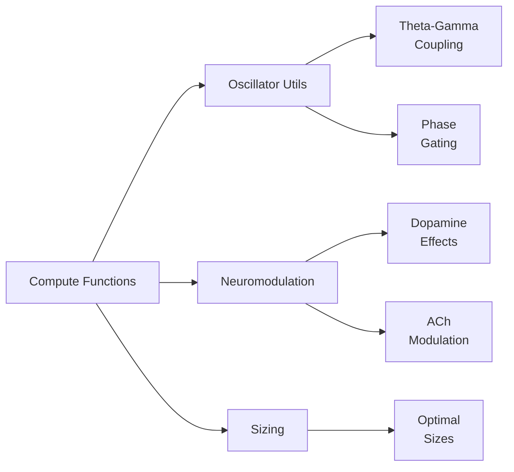

# Compute Functions Reference

> **Auto-generated documentation** - Do not edit manually!
> Last updated: 2026-01-25 18:43:05
> Generated from: `scripts/generate_api_docs.py`

This document catalogs all `compute_*` utility functions that implement biological computations throughout the Thalia codebase.

Total: **5** compute functions

  

## 📋 Quick Reference by Category

| Category | Functions | Purpose |
|----------|-----------|----------|
| **Oscillator** | 5 | Phase-based modulation and coupling |
| **Neuromodulation** | 0 | Dopamine, ACh effect computation |
| **Sizing** | 0 | Region size calculations |

## 🔬 Function Categories



## 🌊 Oscillator Modulation Functions

### [``compute_ach_recurrent_suppression()``](../../src/thalia/utils/oscillator_utils.py#L78)

**Returns**: `float`  
**Source**: [`thalia/utils/oscillator_utils.py`](../../src/thalia/utils/oscillator_utils.py)

**Description**: Compute ACh-mediated suppression of recurrent connections.

**Parameters**:

| Parameter | Type | Default |
|-----------|------|----------|
| `ach_level` | `float` | `-` |

**Biological Context**:

Biological Basis:
    Acetylcholine modulates the balance between afferent and recurrent input:
    - **Low ACh (<0.5)**: Full recurrence for memory retrieval

**Examples**:

```python
>>> assert gain == 0.3
```

---

### [``compute_learning_rate_modulation()``](../../src/thalia/utils/oscillator_utils.py#L215)

**Returns**: `float`  
**Source**: [`thalia/utils/oscillator_utils.py`](../../src/thalia/utils/oscillator_utils.py)

**Description**: Compute gamma-modulated learning rate.

**Parameters**:

| Parameter | Type | Default |
|-----------|------|----------|
| `base_lr` | `float` | `-` |
| `gamma_modulation` | `float` | `-` |
| `scale` | `float` | `GAMMA_LEARNING_MODULATION_SCALE` |

**Biological Context**:

Biological Basis:
    Plasticity is enhanced during gamma peaks when neurons are most
    responsive to input, implementing a form of attentional gating.

**Examples**:

```python
>>> assert lr == 0.005  # 50% of base
```

---

### [``compute_oscillator_modulated_gain()``](../../src/thalia/utils/oscillator_utils.py#L176)

**Returns**: `float`  
**Source**: [`thalia/utils/oscillator_utils.py`](../../src/thalia/utils/oscillator_utils.py)

**Description**: Generic function for oscillator-modulated gain computation.

**Parameters**:

| Parameter | Type | Default |
|-----------|------|----------|
| `base_gain` | `float` | `-` |
| `modulation_range` | `float` | `-` |
| `modulation_value` | `float` | `-` |

**Examples**:

```python
>>> assert gate == 0.1  # Minimal strength during retrieval
```

---

### [``compute_theta_encoding_retrieval()``](../../src/thalia/utils/oscillator_utils.py#L33)

**Returns**: `tuple[float, float]`  
**Source**: [`thalia/utils/oscillator_utils.py`](../../src/thalia/utils/oscillator_utils.py)

**Description**: Compute theta-phase encoding/retrieval modulation.

**Parameters**:

| Parameter | Type | Default |
|-----------|------|----------|
| `theta_phase` | `float` | `-` |

**Biological Context**:

Biological Basis:
    Theta rhythm coordinates encoding and retrieval in hippocampus and cortex:
    - **Theta Peak (0°)**: Strong DG→CA3 (pattern separation), weak EC→CA1

**Examples**:

```python
>>> assert abs(enc - 0.5) < 0.01 and abs(ret - 0.5) < 0.01
```

---

### [``compute_theta_gamma_coupling_gate()``](../../src/thalia/utils/oscillator_utils.py#L127)

**Returns**: `float`  
**Source**: [`thalia/utils/oscillator_utils.py`](../../src/thalia/utils/oscillator_utils.py)

**Description**: Compute theta-gamma cross-frequency coupling gating.

**Parameters**:

| Parameter | Type | Default |
|-----------|------|----------|
| `theta_phase` | `float` | `-` |
| `gamma_phase` | `float` | `-` |
| `sigma` | `float` | `THETA_GAMMA_PHASE_DIFF_SIGMA` |

**Biological Context**:

Biological Basis:
    Theta-gamma coupling coordinates multi-timescale processing:
    - **Theta**: Organizes sequences and encoding/retrieval cycles

**Examples**:

```python
>>> assert coupling < 0.1
```

---

## Usage Patterns

### Oscillator Modulation Pattern

```python
from thalia.utils.oscillator_utils import (
    compute_theta_encoding_retrieval,
    compute_gamma_phase_gate
)

# Theta-based encoding/retrieval switching
theta_phase = oscillators['theta'].phase
encoding_strength, retrieval_strength = compute_theta_encoding_retrieval(theta_phase)

# Gamma phase gating
gamma_phase = oscillators['gamma'].phase
gate = compute_gamma_phase_gate(gamma_phase, window_deg=60.0)
```

### Neuromodulation Pattern

```python
from thalia.neuromodulation.constants import (
    compute_dopamine_effect,
    compute_acetylcholine_effect
)

# Apply dopamine modulation
da_level = self.get_neuromodulator_level('dopamine')
modulated_lr = base_lr * compute_dopamine_effect(da_level)

# Apply acetylcholine modulation
ach_level = self.get_neuromodulator_level('acetylcholine')
encoding_bias = compute_acetylcholine_effect(ach_level)
```

## See Also

- [CONSTANTS_REFERENCE.md](CONSTANTS_REFERENCE.md) - Biological constants used by compute functions
- [COMPONENT_CATALOG.md](COMPONENT_CATALOG.md) - Regions that use these functions
- [USAGE_EXAMPLES.md](USAGE_EXAMPLES.md) - Real-world usage examples

