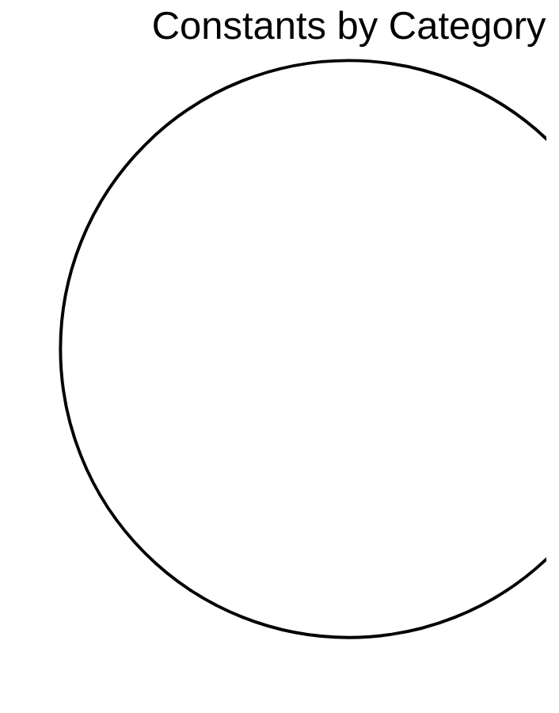

# Constants Reference

> **Auto-generated documentation** - Do not edit manually!
> Last updated: 2026-01-16 21:25:28
> Generated from: `scripts/generate_api_docs.py`

This document catalogs all module-level constants with biological context, ranges, and scientific references.

Total: **0** constants

  

## 📊 Category Overview



## 📑 Categories


## Usage Guide

Constants should be imported directly from their source modules:

```python
# Neuron parameters
from thalia.components.neurons.neuron_constants import (
    TAU_MEM_STANDARD,
    V_THRESHOLD_STANDARD,
)

# Learning parameters
from thalia.regulation.learning_constants import (
    LEARNING_RATE_STDP,
    TAU_ELIGIBILITY_STANDARD,
)

# Neuromodulation
from thalia.neuromodulation.constants import (
    DA_PHASIC_DECAY_PER_MS,
    ACH_ENCODING_LEVEL,
)
```

## See Also

- [CONFIGURATION_REFERENCE.md](CONFIGURATION_REFERENCE.md) - Config classes that use these constants
- [COMPONENT_CATALOG.md](COMPONENT_CATALOG.md) - Components using these parameters
- [NEURON_FACTORIES_REFERENCE.md](NEURON_FACTORIES_REFERENCE.md) - Pre-configured neuron populations

