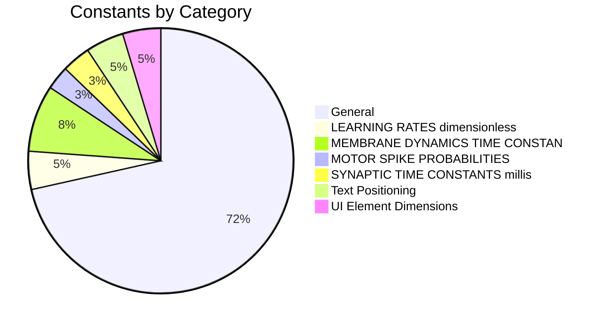

# Constants Reference

> **Auto-generated documentation** - Do not edit manually!
> Last updated: 2025-12-23 15:50:40
> Generated from: `scripts/generate_api_docs.py`

This document catalogs all module-level constants with biological context, ranges, and scientific references.

Total: **172** constants

  

## 📊 Category Overview



## 📑 Categories

- [General](#general)
- [LEARNING RATES (dimensionless)](#learning-rates-(dimensionless))
- [MEMBRANE DYNAMICS TIME CONSTANTS (milliseconds)](#membrane-dynamics-time-constants-(milliseconds))
- [MOTOR SPIKE PROBABILITIES](#motor-spike-probabilities)
- [SYNAPTIC TIME CONSTANTS (milliseconds)](#synaptic-time-constants-(milliseconds))
- [Text Positioning](#text-positioning)
- [UI Element Dimensions](#ui-element-dimensions)

## General

| Constant | Value | Biological Range | Description |
|----------|-------|------------------|-------------|
| `ACH_BASELINE` | `0.3` | — | No description |
| `ADAPT_INCREMENT_CORTEX_L23` | `0.3` | — | Very strong adaptation for cortical L2/3 pyramidal neurons. |
| `ADAPT_INCREMENT_MODERATE` | `0.05` | — | Moderate adaptation increment. |
| `ADAPT_INCREMENT_NONE` | `0.0` | — | No adaptation (default). |
| `ADAPT_INCREMENT_STRONG` | `0.1` | — | Strong adaptation increment. |
| `DATASET_WEIGHT_GAZE` | `0.1` | — | Gaze following dataset weight for Birth stage (10%). |
| `DATASET_WEIGHT_MNIST` | `0.4` | — | MNIST dataset sampling weight for Birth stage (40%). |
| `DATASET_WEIGHT_PHONOLOGY` | `0.3` | — | Phonology dataset weight for Birth stage (30%). |
| `DATASET_WEIGHT_TEMPORAL` | `0.2` | — | Temporal sequence dataset weight for Birth stage (20%). |
| `DA_BASELINE_STANDARD` | `0.2` | — | No description |
| `DA_BASELINE_STRIATUM` | `0.3` | — | No description |
| `E_EXCITATORY` | `3.0` | — | Excitatory reversal potential (normalized). |
| `E_INHIBITORY` | `-0.5` | — | Inhibitory reversal potential (normalized). |
| `E_LEAK` | `0.0` | — | Leak reversal potential (normalized). |
| `FIRING_RATE_EMA_TAU` | `1000.0` | — | Time constant for exponential moving average of firing rate (1 second). |
| `FIRING_RATE_WINDOW_MS` | `100.0` | — | Time window for estimating instantaneous firing rate (100ms). |
| `G_LEAK_FAST` | `0.1` | — | Fast-spiking leak conductance (normalized). |
| `G_LEAK_SLOW` | `0.033` | — | Slow-adapting leak conductance (normalized). |
| `G_LEAK_STANDARD` | `0.05` | — | Standard leak conductance (normalized). |
| `HOMEOSTATIC_TAU_FAST` | `100.0` | — | Fast homeostatic adaptation (100ms). |
| `HOMEOSTATIC_TAU_SLOW` | `10000.0` | — | Slow homeostatic adaptation (10 seconds). |
| `HOMEOSTATIC_TAU_STANDARD` | `1000.0` | — | Standard homeostatic time constant (1 second). |
| `HOMEOSTATIC_TAU_VERY_SLOW` | `60000.0` | — | Very slow homeostatic adaptation (1 minute). |
| `INTRINSIC_PLASTICITY_RATE` | `0.0001` | — | Rate of intrinsic plasticity (threshold/excitability adjustment). |
| `LEARNING_RATE_BCM` | `0.01` | — | Standard BCM learning rate for unsupervised feature learning. |
| `LEARNING_RATE_DEFAULT` | `0.01` | — | Default learning rate when specific rule is not specified. |
| `LEARNING_RATE_ERROR_CORRECTIVE` | `0.005` | — | Supervised error-corrective learning rate (delta rule). |
| `LEARNING_RATE_HEBBIAN` | `0.01` | — | Basic Hebbian learning rate (pre × post). |
| `LEARNING_RATE_HEBBIAN_SLOW` | `0.001` | — | Slow Hebbian learning for stable multimodal integration. |
| `LEARNING_RATE_ONE_SHOT` | `0.1` | — | One-shot learning rate for hippocampal episodic memory. |
| `LEARNING_RATE_PRECISION` | `0.001` | — | Precision weight learning rate for predictive coding networks. |
| `LEARNING_RATE_STDP` | `0.001` | — | Standard STDP learning rate for cortical synapses. |
| `LEARNING_RATE_STDP_FAST` | `0.005` | — | Fast STDP for rapid adaptation (critical periods). |
| `LEARNING_RATE_STDP_MODERATE` | `0.0015` | — | Moderate STDP for pathways requiring slightly faster adaptation. |
| `LEARNING_RATE_STDP_SLOW` | `0.0001` | — | Slow STDP for stable, incremental learning. |
| `LEARNING_RATE_THREE_FACTOR` | `0.001` | — | Dopamine-modulated three-factor learning rate (eligibility × dopamine). |
| `MAX_FIRING_RATE_HZ` | `100.0` | — | Maximum acceptable firing rate before considering runaway activity (100 Hz). |
| `MIN_FIRING_RATE_HZ` | `0.1` | — | Minimum acceptable firing rate before considering neuron dead (0.1 Hz). |
| `NE_BASELINE` | `0.3` | — | No description |
| `NE_GAIN_MAX` | `1.5` | — | No description |
| `NE_GAIN_MIN` | `1.0` | — | No description |
| `NOISE_STD_NONE` | `0.0` | — | No membrane noise (deterministic). |
| `PREFRONTAL_PATIENCE_MIN` | `0.001` | — | Minimum patience parameter (k_min) for goal hierarchy. |
| `PROGRESS_BAR_HEIGHT` | `0.5` | — | Height of horizontal progress bars. |
| `PROPRIOCEPTION_NOISE_SCALE` | `0.1` | — | Proprioceptive noise standard deviation. |
| `SATURATION_THRESHOLD_HZ` | `50.0` | — | Firing rate above which region is considered saturated (50 Hz). |
| `SENSORIMOTOR_WEIGHT_MANIPULATION` | `0.25` | — | Manipulation task weight (25%). |
| `SENSORIMOTOR_WEIGHT_MOTOR_CONTROL` | `0.25` | — | Motor control task weight (25%). |
| `SENSORIMOTOR_WEIGHT_PREDICTION` | `0.25` | — | Prediction task weight (25%). |
| `SENSORIMOTOR_WEIGHT_REACHING` | `0.25` | — | Reaching task weight (25%). |
| `SILENCE_THRESHOLD_HZ` | `0.5` | — | Firing rate below which region is considered silent (0.5 Hz). |
| `SPIKE_PROBABILITY_HIGH` | `0.5` | — | High motor activity spike probability (50%). |
| `SPIKE_PROBABILITY_LOW` | `0.15` | — | Low motor activity spike probability (15%). |
| `SPIKE_PROBABILITY_MEDIUM` | `0.3` | — | Medium motor activity spike probability (30%). |
| `STDP_A_MINUS_CORTEX` | `0.012` | — | LTD amplitude for cortical STDP (depression when pre follows post). |
| `STDP_A_MINUS_HIPPOCAMPUS` | `0.022` | — | LTD amplitude for hippocampal STDP (stronger than cortex). |
| `STDP_A_PLUS_CORTEX` | `0.01` | — | LTP amplitude for cortical STDP (potentiation when post follows pre). |
| `STDP_A_PLUS_HIPPOCAMPUS` | `0.02` | — | LTP amplitude for hippocampal STDP (stronger than cortex). |
| `STRIATUM_GAMMA` | `0.99` | — | Discount factor for future rewards (0-1). |
| `STRIATUM_RELAY_THRESHOLD` | `0.5` | — | Threshold for converting continuous activations to spikes. |
| `STRIATUM_TD_ACCUMULATING` | `True` | — | Whether to use accumulating (True) or replacing (False) traces. |
| `STRIATUM_TD_LAMBDA` | `0.9` | — | TD(λ) trace decay parameter (0-1). |
| `STRIATUM_TD_MIN_TRACE` | `1e-06` | — | Minimum eligibility trace value. |
| `SYNAPTIC_SCALING_MAX` | `10.0` | — | Maximum scaling factor (prevents runaway growth). |
| `SYNAPTIC_SCALING_MIN` | `0.1` | — | Minimum scaling factor (prevents complete shutdown). |
| `SYNAPTIC_SCALING_RATE` | `0.001` | — | Rate of synaptic scaling (global weight adjustment). |
| `TARGET_FIRING_RATE_HIGH` | `30.0` | — | High target firing rate (30 Hz) for interneurons and dense representations. |
| `TARGET_FIRING_RATE_INTERNEURON` | `20.0` | — | Typical firing rate for fast-spiking interneurons (20 Hz). |
| `TARGET_FIRING_RATE_LOW` | `1.0` | — | Low target firing rate (1 Hz) for very sparse representations. |
| `TARGET_FIRING_RATE_MEDIUM` | `10.0` | — | Medium target firing rate (10 Hz) for moderate activity levels. |
| `TARGET_FIRING_RATE_SPARSE` | `2.0` | — | Sparse coding target (2 Hz) for energy-efficient representations. |
| `TARGET_FIRING_RATE_STANDARD` | `5.0` | — | Standard target firing rate for pyramidal neurons (5 Hz). |
| `TAU_ADAPT_STANDARD` | `100.0` | — | Standard adaptation time constant (ms). |
| `TAU_BCM_THRESHOLD` | `5000.0` | — | BCM sliding threshold adaptation time constant (5 seconds). |
| `TAU_BCM_THRESHOLD_FAST` | `2000.0` | — | Fast BCM threshold adaptation (2 seconds) for rapid environment changes. |
| `TAU_BCM_THRESHOLD_SLOW` | `10000.0` | — | Slow BCM threshold adaptation (10 seconds) for stable learning. |
| `TAU_ELIGIBILITY_LONG` | `2000.0` | — | Long eligibility trace (2 seconds). |
| `TAU_ELIGIBILITY_SHORT` | `500.0` | — | Short eligibility trace (500ms). |
| `TAU_ELIGIBILITY_STANDARD` | `1000.0` | — | Standard eligibility trace time constant (1 second). |
| `TAU_MEM_FAST` | `10.0` | — | Fast membrane time constant (ms). |
| `TAU_MEM_SLOW` | `30.0` | — | Slow membrane time constant (ms). |
| `TAU_MEM_STANDARD` | `20.0` | — | Standard membrane time constant (ms). |
| `TAU_REF_FAST` | `1.0` | — | Fast refractory period (ms). |
| `TAU_REF_SLOW` | `7.0` | — | Slow refractory period (ms). |
| `TAU_REF_STANDARD` | `5.0` | 3-7ms | Standard absolute refractory period (ms). |
| `TAU_STDP_MINUS` | `20.0` | — | STDP depression time constant (20ms). |
| `TAU_STDP_PLUS` | `20.0` | — | STDP potentiation time constant (20ms). |
| `TAU_SYN_EXCITATORY` | `5.0` | — | Excitatory synaptic time constant (ms). |
| `TAU_SYN_GABA_B` | `150.0` | — | GABA_B receptor time constant (ms). |
| `TAU_SYN_INHIBITORY` | `10.0` | — | Inhibitory synaptic time constant (ms). |
| `TAU_SYN_NMDA` | `100.0` | — | NMDA receptor time constant (ms). |
| `TAU_TRACE_MEDIUM` | `50.0` | — | Medium-term trace for working memory operations (50ms). |
| `TAU_TRACE_SHORT` | `10.0` | — | Short-term trace for fast synaptic dynamics (10ms). |
| `TEXT_POSITION_BOTTOM_RIGHT_X` | `0.98` | — | X position for bottom-right text (right-aligned). |
| `TEXT_POSITION_BOTTOM_RIGHT_Y` | `0.98` | — | Y position for bottom-right text (top-aligned). |
| `TEXT_POSITION_CENTER` | `0.5` | — | Center position for text placement in plots. |
| `TEXT_POSITION_TOP_LEFT` | `0.1` | — | Position for top-left text placement. |
| `THALAMUS_ALPHA_GATE_THRESHOLD` | `0.0` | — | Alpha phase threshold for suppression (normalized). |
| `THALAMUS_ALPHA_SUPPRESSION` | `0.5` | — | Alpha oscillation suppression strength (0-1). |
| `THALAMUS_BURST_GAIN` | `2.0` | — | Amplification factor for burst mode. |
| `THALAMUS_BURST_SPIKE_COUNT` | `3` | — | Number of spikes in a thalamic burst (typical value). |
| `THALAMUS_BURST_THRESHOLD` | `-0.2` | — | Membrane potential threshold for burst mode (normalized). |
| `THALAMUS_CENTER_EXCITATION` | `1.5` | — | Center excitation strength in receptive field. |
| `THALAMUS_MODE_THRESHOLD` | `0.5` | — | Threshold for burst/tonic mode detection. |
| `THALAMUS_NE_GAIN_SCALE` | `0.5` | — | Norepinephrine gain modulation scale. |
| `THALAMUS_RELAY_SCALE` | `0.3` | — | Weight scale for relay connections. |
| `THALAMUS_RELAY_SPARSITY` | `0.3` | — | Sparsity for thalamus → cortex relay connections. |
| `THALAMUS_RELAY_STRENGTH` | `1.2` | — | Base relay gain for thalamic amplification. |
| `THALAMUS_SPATIAL_CENTER_SCALE` | `0.15` | — | Weight scale for center-surround connections. |
| `THALAMUS_SPATIAL_CENTER_SPARSITY` | `0.2` | — | Sparsity for center-surround spatial filters. |
| `THALAMUS_SPATIAL_FILTER_WIDTH` | `0.15` | — | Gaussian filter width for center-surround receptive fields. |
| `THALAMUS_SURROUND_INHIBITION` | `0.5` | — | Surround inhibition strength in receptive field. |
| `THALAMUS_TONIC_THRESHOLD` | `0.3` | — | Membrane potential threshold for tonic mode (normalized). |
| `THALAMUS_TRN_FEEDBACK_SCALE` | `0.4` | — | Weight scale for TRN feedback connections. |
| `THALAMUS_TRN_FEEDBACK_SPARSITY` | `0.2` | — | Sparsity for cortex → TRN feedback connections. |
| `THALAMUS_TRN_FEEDFORWARD_SPARSITY` | `0.3` | — | Sparsity for TRN → relay feedforward connections. |
| `THALAMUS_TRN_INHIBITION` | `0.3` | — | Strength of TRN → relay inhibition. |
| `THALAMUS_TRN_RATIO` | `0.2` | — | TRN neurons as fraction of relay neurons. |
| `THALAMUS_TRN_RECURRENT` | `0.4` | 7-14 Hz | TRN recurrent inhibition strength. |
| `THRESHOLD_ADAPTATION_TAU` | `1000.0` | — | Time constant for adaptive threshold mechanisms (1 second). |
| `V_RESET_STANDARD` | `0.0` | — | Standard reset potential (normalized). |
| `V_REST_STANDARD` | `0.0` | — | Standard resting membrane potential (normalized). |
| `V_THRESHOLD_STANDARD` | `1.0` | — | Standard spike threshold (normalized). |

### Detailed Documentation

#### `ADAPT_INCREMENT_CORTEX_L23`

**Value**: `0.3`

Very strong adaptation for cortical L2/3 pyramidal neurons.

**References**: Vives et al. (2000), Cormick et al. (1985)

**Source**: `[`thalia/components/neurons/neuron_constants.py`](../../src/thalia/components/neurons/neuron_constants.py)`

#### `STDP_A_MINUS_CORTEX`

**Value**: `0.012`

LTD amplitude for cortical STDP (depression when pre follows post).

**References**: Bi & Poo (1998)

**Source**: `[`thalia/regulation/learning_constants.py`](../../src/thalia/regulation/learning_constants.py)`

#### `STDP_A_PLUS_CORTEX`

**Value**: `0.01`

LTP amplitude for cortical STDP (potentiation when post follows pre).

**References**: Bi & Poo (1998), Clopath et al. (2010)

**Source**: `[`thalia/regulation/learning_constants.py`](../../src/thalia/regulation/learning_constants.py)`

#### `TAU_ELIGIBILITY_LONG`

**Value**: `2000.0`

Long eligibility trace (2 seconds).

**References**: Yagishita et al. (2014)

**Source**: `[`thalia/regulation/learning_constants.py`](../../src/thalia/regulation/learning_constants.py)`

---

## LEARNING RATES (dimensionless)

| Constant | Value | Biological Range | Description |
|----------|-------|------------------|-------------|
| `EMA_DECAY_FAST` | `0.99` | — | Fast exponential moving average decay for activity history. |
| `EMA_DECAY_SLOW` | `0.999` | — | Slow exponential moving average decay for long-term tracking. |
| `PHASE_RANGE_2PI` | `6.283185307179586` | — | No description |
| `SILENCE_DETECTION_THRESHOLD` | `0.001` | 1-10 Hz | Firing rate threshold below which a region is considered silent. |
| `TAU_TRACE_LONG` | `200.0` | — | Long-term trace for sustained activity patterns (200ms). |
| `WEIGHT_INIT_SCALE_PREDICTIVE` | `0.1` | — | Weight initialization scale for predictive coding pathways. |
| `WEIGHT_INIT_SCALE_RECURRENT` | `0.01` | — | Weight initialization scale for recurrent/associative connections. |
| `WM_NOISE_STD_DEFAULT` | `0.01` | — | Default working memory noise standard deviation. |

---

## MEMBRANE DYNAMICS TIME CONSTANTS (milliseconds)

| Constant | Value | Biological Range | Description |
|----------|-------|------------------|-------------|
| `DECISION_THRESHOLD_DEFAULT` | `0.5` | — | Default decision threshold (normalized). |
| `NE_MAX_GAIN` | `1.5` | — | No description |
| `NOISE_STD_LOW` | `0.01` | — | Low membrane noise. |
| `NOISE_STD_MODERATE` | `0.05` | — | Moderate membrane noise. |
| `PROPRIOCEPTION_NOISE_SCALE` | `0.05` | — | Proprioceptive feedback noise scale. |
| `SPIKE_PROBABILITY_HIGH` | `0.2` | — | High spike probability threshold. |
| `SPIKE_PROBABILITY_LOW` | `0.1` | — | Low spike probability threshold. |
| `SPIKE_PROBABILITY_MEDIUM` | `0.15` | — | Medium spike probability threshold. |
| `STIMULUS_STRENGTH_HIGH` | `0.8` | — | High stimulus strength. |
| `THETA_BASELINE_MIN` | `0.7` | — | Minimum theta baseline modulation factor. |
| `TONIC_D1_GAIN_SCALE` | `0.5` | — | Tonic dopamine modulation of D1 pathway gain. |
| `WEIGHT_INIT_SCALE_MODERATE` | `0.2` | — | Moderate weight initialization scale. |
| `WEIGHT_INIT_SCALE_SMALL` | `0.1` | — | Small weight initialization scale. |
| `WEIGHT_INIT_SCALE_SPARSITY_DEFAULT` | `0.3` | — | Default sparsity for sparse connectivity. |

---

## MOTOR SPIKE PROBABILITIES

| Constant | Value | Biological Range | Description |
|----------|-------|------------------|-------------|
| `MATCH_PROBABILITY_DEFAULT` | `0.3` | — | Default match probability for n-back working memory tasks (30%). |
| `REWARD_SCALE_PREDICTION` | `1.0` | — | Scaling factor for prediction-based rewards. |
| `STIMULUS_STRENGTH_HIGH` | `1.0` | — | High stimulus strength for salient stimuli. |
| `WEIGHT_INIT_SCALE_SMALL` | `0.05` | — | Small weight initialization scale. |
| `WORKSPACE_SIZE_DEFAULT` | `1.0` | — | Default workspace size for sensorimotor tasks. |

---

## SYNAPTIC TIME CONSTANTS (milliseconds)

| Constant | Value | Biological Range | Description |
|----------|-------|------------------|-------------|
| `BASELINE_EXCITATION_SCALE` | `1.2` | — | Baseline excitation scale factor. |
| `INTRINSIC_LEARNING_THRESHOLD` | `0.3` | — | Intrinsic reward threshold for learning. |
| `MATCH_THRESHOLD` | `0.5` | — | Pattern match threshold. |
| `THETA_BASELINE_RANGE` | `0.3` | — | Theta baseline modulation range. |
| `THETA_CONTRAST_MIN` | `0.8` | — | Minimum theta contrast modulation factor. |
| `THETA_CONTRAST_RANGE` | `0.2` | — | Theta contrast modulation range. |

---

## Text Positioning

| Constant | Value | Biological Range | Description |
|----------|-------|------------------|-------------|
| `ALPHA_HIGHLIGHT` | `0.2` | — | Alpha value for subtle highlight regions. |
| `ALPHA_SEMI_TRANSPARENT` | `0.5` | — | Alpha value for semi-transparent overlays. |
| `AXIS_MARGIN_NEGATIVE` | `-0.5` | — | Negative axis margin for plot boundaries. |
| `AXIS_MARGIN_POSITIVE` | `0.5` | — | Positive axis margin for plot boundaries. |
| `FIRING_RATE_RUNAWAY_THRESHOLD` | `0.9` | — | Above this rate, region shows runaway excitation (90%). |
| `FIRING_RATE_SILENCE_THRESHOLD` | `0.01` | — | Below this rate, region is considered silent (1%). |
| `TARGET_SPIKE_RATE_LOWER` | `0.05` | — | Lower bound for target spike rate (5% - sparse coding). |
| `TARGET_SPIKE_RATE_UPPER` | `0.15` | — | Upper bound for target spike rate (15% - active coding). |

---

## UI Element Dimensions

| Constant | Value | Biological Range | Description |
|----------|-------|------------------|-------------|
| `CALIBRATION_EXCELLENT_ECE` | `0.1` | — | Expected Calibration Error threshold for excellent calibration. |
| `CALIBRATION_GOOD_ECE` | `0.15` | — | Expected Calibration Error threshold for good calibration. |
| `DIFFICULTY_RANGE_MAX` | `0.9` | — | Maximum difficulty for task generation (90%). |
| `DIFFICULTY_RANGE_MIN` | `0.3` | — | Minimum difficulty for task generation (30%). |
| `PERFORMANCE_ACCEPTABLE` | `0.85` | — | Acceptable performance threshold (85% accuracy). |
| `PERFORMANCE_EXCELLENT` | `0.95` | — | Excellent performance threshold (95% accuracy). |
| `PERFORMANCE_GOOD` | `0.9` | — | Good performance threshold (90% accuracy). |
| `PERFORMANCE_POOR` | `0.7` | — | Poor performance threshold (70% accuracy). |

---

## References

Scientific references cited in constant definitions:

- Bi & Poo (1998)
- Clopath et al. (2010)
- Cormick et al. (1985)
- Vives et al. (2000)
- Yagishita et al. (2014)

## Usage Guide

Constants should be imported directly from their source modules:

```python
# Neuron parameters
from thalia.components.neurons.neuron_constants import (
    TAU_MEM_STANDARD,
    V_THRESHOLD_STANDARD,
)

# Learning parameters
from thalia.regulation.learning_constants import (
    LEARNING_RATE_STDP,
    TAU_ELIGIBILITY_STANDARD,
)

# Neuromodulation
from thalia.neuromodulation.constants import (
    DA_PHASIC_DECAY_PER_MS,
    ACH_ENCODING_LEVEL,
)
```

## See Also

- [CONFIGURATION_REFERENCE.md](CONFIGURATION_REFERENCE.md) - Config classes that use these constants
- [COMPONENT_CATALOG.md](COMPONENT_CATALOG.md) - Components using these parameters
- [NEURON_FACTORIES_REFERENCE.md](NEURON_FACTORIES_REFERENCE.md) - Pre-configured neuron populations

