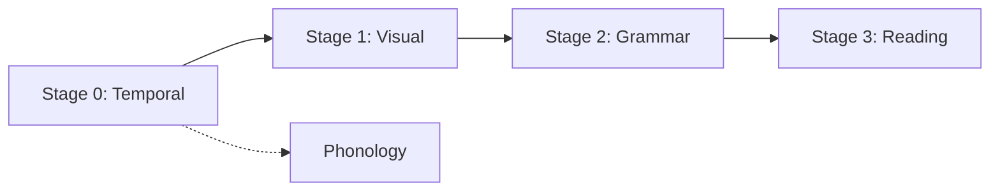

# Datasets Reference

> **Auto-generated documentation** - Do not edit manually!
> Last updated: 2026-01-26 14:17:33
> Generated from: `scripts/generate_api_docs.py`

This document catalogs all dataset classes and factory functions for curriculum training stages.

Total: 4 dataset classes, 4 factory functions

## 📊 Distribution by Stage

| Stage | Count |
|-------|-------|
| Stage 0 (Temporal) | 1 |
| Stage 0 (Phonology) | 1 |
| Stage 1 (Visual) | 1 |
| Stage 2 (Grammar) | 1 |
| Stage 3 (Reading) | 1 |

## 📚 Curriculum Stages

## Dataset Classes

### [``GrammarDataset``](../../src/thalia/datasets/grammar.py#L251)

**Source**: [`thalia/datasets/grammar.py`](../../src/thalia/datasets/grammar.py)

**Description**: Grammar learning dataset for Stage 2.

---

### [``PhonologicalDataset``](../../src/thalia/datasets/phonology.py#L346)

**Source**: [`thalia/datasets/phonology.py`](../../src/thalia/datasets/phonology.py)

**Curriculum Stage**: Stage 0 (Phonology)

**Description**: Phonological tasks for categorical perception learning.

---

### [``ReadingDataset``](../../src/thalia/datasets/reading.py#L269)

**Source**: [`thalia/datasets/reading.py`](../../src/thalia/datasets/reading.py)

**Description**: Reading comprehension dataset for Stage 3.

---

### [``TemporalSequenceDataset``](../../src/thalia/datasets/temporal_sequences.py#L50)

**Source**: [`thalia/datasets/temporal_sequences.py`](../../src/thalia/datasets/temporal_sequences.py)

**Description**: Temporal sequence dataset for Stage 0 (Phonology).

---

## Factory Functions

### Stage 0 (Temporal)

#### [``create_stage0_temporal_dataset()``](../../src/thalia/datasets/temporal_sequences.py#L361)

**Source**: [`thalia/datasets/temporal_sequences.py`](../../src/thalia/datasets/temporal_sequences.py)

**Parameters**:

| Parameter | Type | Default |
|-----------|------|----------|
| `device` | `torch.device` | `torch.device('cpu')` |

**Description**: Create temporal sequence dataset for Stage 0.

---

### Stage 1 (Visual)

#### [``create_stage1_cifar_datasets()``](../../src/thalia/datasets/cifar_wrapper.py#L379)

**Source**: [`thalia/datasets/cifar_wrapper.py`](../../src/thalia/datasets/cifar_wrapper.py)

**Parameters**:

| Parameter | Type | Default |
|-----------|------|----------|
| `device` | `torch.device` | `torch.device('cpu')` |
| `encoding` | `str` | `'rate'` |
| `n_timesteps` | `int` | `100` |

**Description**: Create CIFAR-10 train/test datasets for Stage 1.

---

### Stage 2 (Grammar)

#### [``create_stage2_grammar_dataset()``](../../src/thalia/datasets/grammar.py#L584)

**Source**: [`thalia/datasets/grammar.py`](../../src/thalia/datasets/grammar.py)

**Parameters**:

| Parameter | Type | Default |
|-----------|------|----------|
| `device` | `torch.device` | `torch.device('cpu')` |
| `multilingual` | `bool` | `False` |
| `language` | `Language` | `Language.ENGLISH` |

**Description**: Create grammar dataset for Stage 2.

---

### Stage 3 (Reading)

#### [``create_stage3_reading_dataset()``](../../src/thalia/datasets/reading.py#L611)

**Source**: [`thalia/datasets/reading.py`](../../src/thalia/datasets/reading.py)

**Parameters**:

| Parameter | Type | Default |
|-----------|------|----------|
| `device` | `torch.device` | `torch.device('cpu')` |
| `language` | `Language` | `Language.ENGLISH` |

**Description**: Create reading dataset for Stage 3.

---

## 💡 Dataset Usage Tips

### Curriculum Training

1. **Follow stage order**: Start with Stage 0, progress sequentially
2. **Validate each stage**: Ensure basic performance before advancing
3. **Adjust difficulty**: Use dataset parameters to control complexity
4. **Monitor learning**: Use diagnostic monitors to track progress

### Common Issues

⚠️ **Encoding mismatch**: Ensure `device` matches brain device

⚠️ **Language mismatch**: Verify `Language` enum for multilingual datasets

⚠️ **Insufficient timesteps**: Use at least 50-100 timesteps for temporal data

