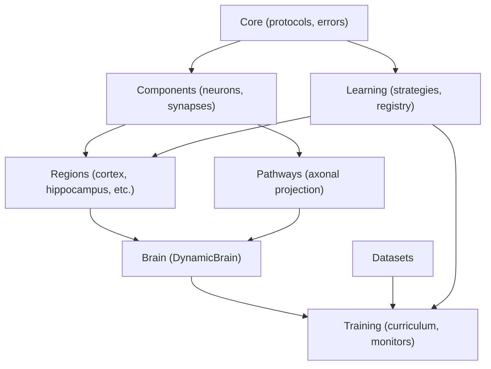
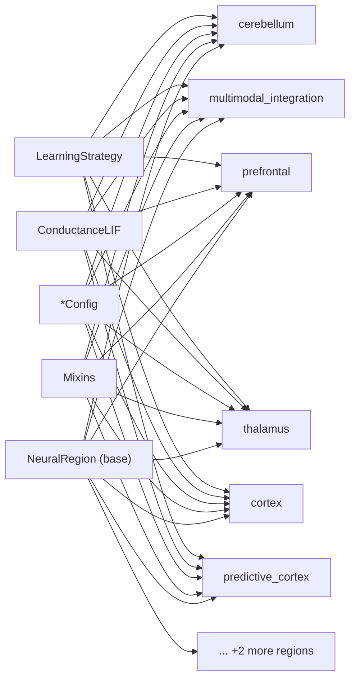
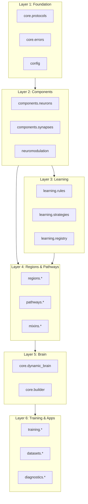

# Dependency Graph

> **Auto-generated documentation** - Do not edit manually!
> Last updated: 2025-12-31 19:33:39
> Generated from: `scripts/generate_api_docs.py`

This document visualizes the dependency relationships between Thalia modules.

## 🔗 Component Dependencies



## 🧠 Region Dependencies



## 📦 Module Import Layers



## 📋 Dependency Guidelines

### Import Rules

1. **Downward dependencies only**: Higher layers import from lower layers
2. **No circular imports**: Modules at the same layer should not import each other
3. **Core is foundation**: All modules can import from `core`
4. **Regions are independent**: Regions should not import from other regions

### Common Import Patterns

```python
# Layer 1 (Foundation)
from thalia.core.protocols import NeuralComponent
from thalia.core.errors import ConfigurationError
from thalia.config import ThaliaConfig

# Layer 2 (Components)
from thalia.components.neurons import ConductanceLIF
from thalia.components.synapses import WeightInitializer
from thalia.neuromodulation import NeuromodulatorManager

# Layer 3 (Learning)
from thalia.learning import create_strategy
from thalia.learning.rules import STDPRule

# Layer 4 (Regions)
from thalia.regions.cortex import LayeredCortex
from thalia.mixins import GrowthMixin

# Layer 5 (Brain)
from thalia.core.dynamic_brain import DynamicBrain
from thalia.core.builder import BrainBuilder

# Layer 6 (Training)
from thalia.training import CurriculumTrainer
from thalia.datasets import create_stage0_temporal_dataset
from thalia.diagnostics import HealthMonitor
```

## ⚠️ Avoiding Circular Dependencies

### Common Pitfalls

- **Region importing Brain**: Use dependency injection instead
- **Config importing Components**: Keep configs as pure data
- **Cross-region imports**: Use protocols/interfaces instead
- **Training importing specific regions**: Use registry pattern

### Solutions

1. **Protocols**: Define interfaces in `core.protocols`
2. **Registry**: Use `ComponentRegistry` for dynamic lookup
3. **Dependency Injection**: Pass dependencies through constructors
4. **Type hints**: Use string literals for forward references

