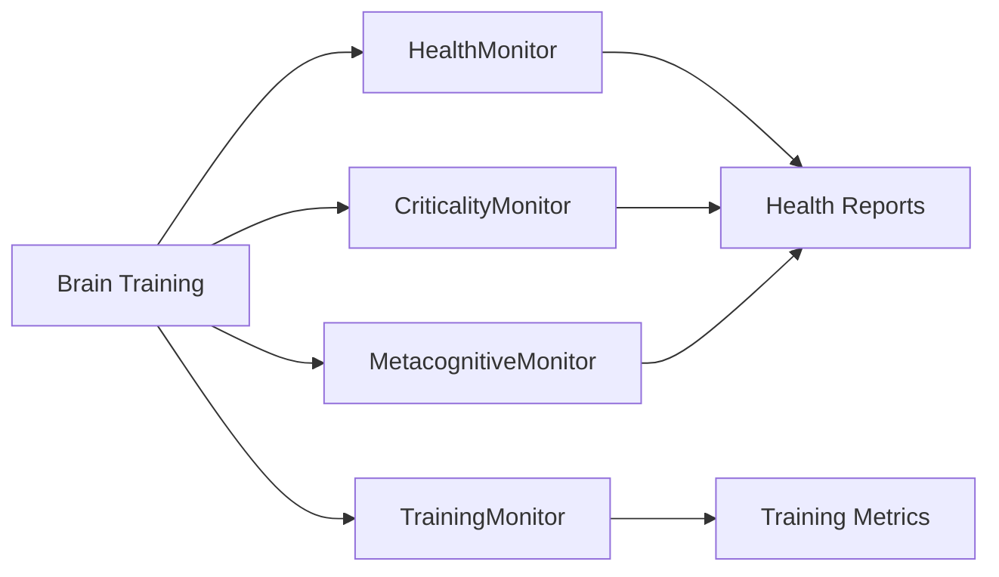

# Diagnostics Reference

> **Auto-generated documentation** - Do not edit manually!
> Last updated: 2026-01-25 23:23:15
> Generated from: `scripts/generate_api_docs.py`

This document catalogs all diagnostic monitor classes for system health and performance monitoring.

Total: **4** monitors

  

## 📊 Monitoring Workflow

## 🔍 Monitor Classes

### [``CriticalityMonitor``](../../src/thalia/diagnostics/criticality.py#L114)

**Source**: [`thalia/diagnostics/criticality.py`](../../src/thalia/diagnostics/criticality.py)

**Description**: Monitor network criticality via branching ratio.

**Key Methods**:

- [`reset_state()`](../../src/thalia/diagnostics/criticality.py#L144)
- [`update(spikes)`](../../src/thalia/diagnostics/criticality.py#L151)
- [`get_branching_ratio()`](../../src/thalia/diagnostics/criticality.py#L251)
- [`get_weight_scaling()`](../../src/thalia/diagnostics/criticality.py#L255)
- [`get_state()`](../../src/thalia/diagnostics/criticality.py#L265)

---

### [``HealthMonitor``](../../src/thalia/diagnostics/health_monitor.py#L157)

**Source**: [`thalia/diagnostics/health_monitor.py`](../../src/thalia/diagnostics/health_monitor.py)

**Description**: Monitor network health and detect pathological states.

**Key Methods**:

- [`check_health(diagnostics)`](../../src/thalia/diagnostics/health_monitor.py#L198)
- [`get_trend_summary()`](../../src/thalia/diagnostics/health_monitor.py#L434)
- [`reset_history()`](../../src/thalia/diagnostics/health_monitor.py#L461)

---

### [``MetacognitiveMonitor``](../../src/thalia/diagnostics/metacognition.py#L208)

**Source**: [`thalia/diagnostics/metacognition.py`](../../src/thalia/diagnostics/metacognition.py)

**Description**: Stage-aware metacognitive monitoring system.

**Key Methods**:

- [`estimate_confidence(population_activity)`](../../src/thalia/diagnostics/metacognition.py#L239)
- [`should_abstain(confidence)`](../../src/thalia/diagnostics/metacognition.py#L303)
- [`calibrate(population_activity, actual_correct, dopamine)`](../../src/thalia/diagnostics/metacognition.py#L331)
- [`set_stage(stage)`](../../src/thalia/diagnostics/metacognition.py#L364)
- [`get_stage()`](../../src/thalia/diagnostics/metacognition.py#L368)

---

### [``OscillatorHealthMonitor``](../../src/thalia/diagnostics/oscillator_health.py#L168)

**Source**: [`thalia/diagnostics/oscillator_health.py`](../../src/thalia/diagnostics/oscillator_health.py)

**Description**: Monitor oscillator health and detect pathological patterns.

**Key Methods**:

- [`check_health(phases, frequencies, amplitudes, signals, couplings)`](../../src/thalia/diagnostics/oscillator_health.py#L198)
- [`reset_history()`](../../src/thalia/diagnostics/oscillator_health.py#L490)
- [`get_oscillator_statistics(oscillator)`](../../src/thalia/diagnostics/oscillator_health.py#L497)
- [`compute_phase_coherence(region1_phases, region2_phases, oscillator)`](../../src/thalia/diagnostics/oscillator_health.py#L533)
- [`compute_region_pair_coherence(region_phases, region_pairs, oscillators)`](../../src/thalia/diagnostics/oscillator_health.py#L585)

---

## 💡 Monitoring Best Practices

### When to Use Each Monitor

- **HealthMonitor**: Every training run (catches pathological states)
- **CriticalityMonitor**: When tuning network connectivity
- **MetacognitiveMonitor**: For confidence estimation and active learning
- **TrainingMonitor**: For visualization and metric tracking

### Interpreting Results

✅ **Healthy network**: Firing rates 0.01-0.1, weights stable, no NaN

⚠️ **Warning signs**: Extreme firing rates, rapid weight changes

❌ **Critical issues**: NaN values, zero activity, runaway excitation

### Performance Tips

- Check health every 10-100 steps (not every step)
- Store history for trend analysis
- Use thresholds to trigger adaptive responses
- Log detailed diagnostics only when issues detected

