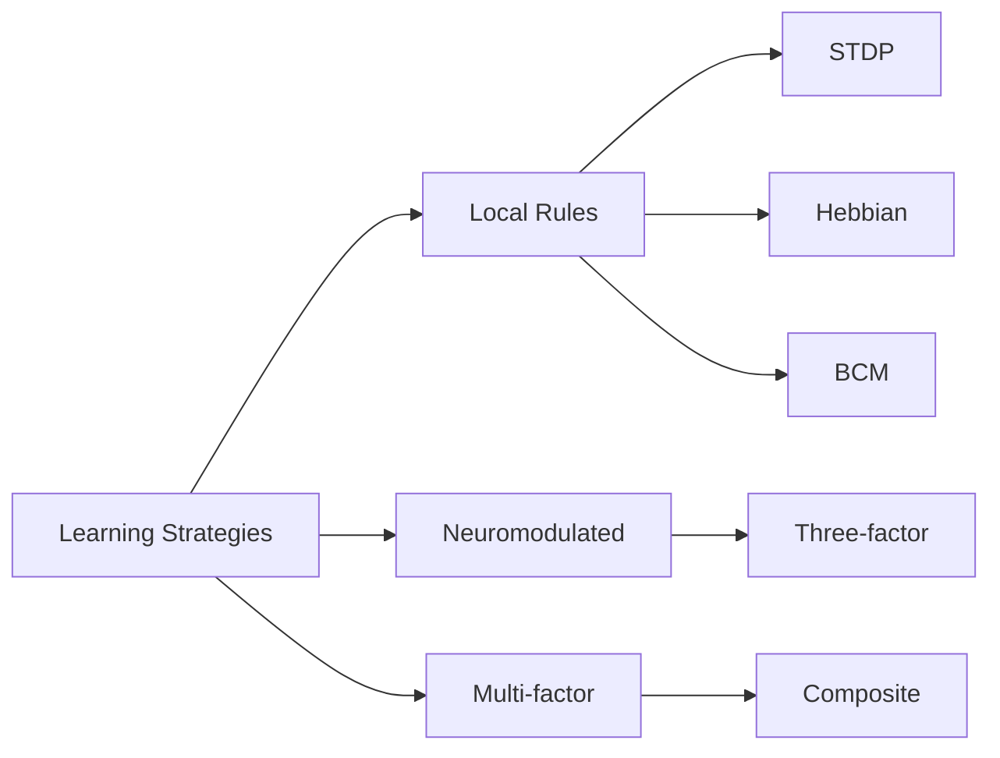

# Learning Strategies API

> **Auto-generated documentation** - Do not edit manually!
> Last updated: 2025-12-23 17:33:00
> Generated from: `scripts/generate_api_docs.py`

This document catalogs all learning strategy factory functions available in Thalia.

Total: **5** factory functions

## 📊 Metrics

| Metric | Value |
|--------|-------|
| **Total Strategies** | 5 |
| **Average Parameters** | 3.8 |
| **With Examples** | 5/5 |
| **With Usage Info** | 4/5 |

  

## 📋 Quick Reference

| Strategy | Best For | Modulator | Biological Accuracy |
|----------|----------|-----------|--------------------|
| `create_cortex_strategy()` | Cortical learning | Optional | ⭐⭐⭐⭐⭐ |
| `create_striatum_strategy()` | Reward learning | Dopamine | ⭐⭐⭐⭐⭐ |
| `create_hippocampus_strategy()` | Memory | Acetylcholine | ⭐⭐⭐⭐ |
| `create_cerebellum_strategy()` | Motor learning | None | ⭐⭐⭐⭐ |
| `create_prefrontal_strategy()` | Executive control | Dopamine | ⭐⭐⭐⭐ |

## 🔄 Strategy Types



## 📚 Factory Functions

### [``create_cerebellum_strategy()``](../../src/thalia/learning/strategy_registry.py#L543)

**Returns**: `LearningStrategy`

**Source**: [`thalia/learning/strategy_registry.py`](../../src/thalia/learning/strategy_registry.py)

**Parameters**:

| Parameter | Type | Default |
|-----------|------|----------|
| `learning_rate` | float | `0.005` |
| `error_threshold` | float | `0.01` |
| `error_config` | Optional[Any] | `None` |

**Examples**:

```python
>>> strategy = create_cerebellum_strategy(error_config=cfg)
```

**Description**: Create error-corrective learning for cerebellum (supervised).

**Typically Used By**: `cerebellum`

---

### [``create_cortex_strategy()``](../../src/thalia/learning/strategy_registry.py#L359)

**Returns**: `LearningStrategy`

**Source**: [`thalia/learning/strategy_registry.py`](../../src/thalia/learning/strategy_registry.py)

**Parameters**:

| Parameter | Type | Default |
|-----------|------|----------|
| `learning_rate` | float | `0.001` |
| `tau_theta` | float | `5000.0` |
| `use_stdp` | bool | `True` |
| `use_bcm` | bool | `True` |
| `stdp_config` | Optional[Any] | `None` |
| `bcm_config` | Optional[Any] | `None` |

**Examples**:

```python
>>> strategy = create_cortex_strategy(use_stdp=False)
```

**Description**: Create composite STDP+BCM strategy for cortical learning.

**Typically Used By**: `cortex`, `visual_cortex`, `auditory_cortex`

---

### [``create_hippocampus_strategy()``](../../src/thalia/learning/strategy_registry.py#L433)

**Returns**: `LearningStrategy`

**Source**: [`thalia/learning/strategy_registry.py`](../../src/thalia/learning/strategy_registry.py)

**Parameters**:

| Parameter | Type | Default |
|-----------|------|----------|
| `learning_rate` | float | `0.01` |
| `one_shot` | bool | `False` |
| `a_plus` | Optional[float] | `None` |
| `tau_plus` | float | `20.0` |
| `tau_minus` | float | `20.0` |
| `stdp_config` | Optional[Any] | `None` |

**Examples**:

```python
>>> strategy = create_hippocampus_strategy(stdp_config=cfg)
```

**Description**: Create hippocampus-appropriate STDP with one-shot capability.

**Typically Used By**: `hippocampus`

---

### [``create_strategy()``](../../src/thalia/learning/rules/strategies.py#L1042)

**Returns**: `BaseStrategy`

**Source**: [`thalia/learning/rules/strategies.py`](../../src/thalia/learning/rules/strategies.py)

**Parameters**:

| Parameter | Type | Default |
|-----------|------|----------|
| `rule_name` | str | `` |

**Examples**:

```python
strategy = create_strategy('stdp', a_plus=0.02, a_minus=0.02)
```

**Description**: Factory function to create learning strategies by name.

---

### [``create_striatum_strategy()``](../../src/thalia/learning/strategy_registry.py#L495)

**Returns**: `LearningStrategy`

**Source**: [`thalia/learning/strategy_registry.py`](../../src/thalia/learning/strategy_registry.py)

**Parameters**:

| Parameter | Type | Default |
|-----------|------|----------|
| `learning_rate` | float | `0.001` |
| `eligibility_tau_ms` | float | `1000.0` |
| `three_factor_config` | Optional[Any] | `None` |

**Examples**:

```python
>>> strategy = create_striatum_strategy(three_factor_config=cfg)
```

**Description**: Create three-factor learning for striatum (dopamine-modulated).

**Typically Used By**: `striatum`

---

## See Also

- [COMPONENT_CATALOG.md](COMPONENT_CATALOG.md) - Components using these strategies
- [CONSTANTS_REFERENCE.md](CONSTANTS_REFERENCE.md) - Learning rate constants
- [PROTOCOLS_REFERENCE.md](PROTOCOLS_REFERENCE.md) - LearningStrategy protocol
- [USAGE_EXAMPLES.md](USAGE_EXAMPLES.md) - Examples of strategy usage

## 💡 Best Practices

### Choosing a Learning Strategy

1. **For cortical regions**: Use `create_cortex_strategy()` with STDP+BCM composite
2. **For reward learning**: Use `create_striatum_strategy()` with dopamine modulation
3. **For memory formation**: Use `create_hippocampus_strategy()` with one-shot capability
4. **For motor learning**: Use `create_cerebellum_strategy()` with error correction
5. **For executive function**: Use `create_prefrontal_strategy()` with gated plasticity

### Parameter Tuning Tips

- **Learning rate**: Start with default values, reduce if unstable
- **Time constants**: Match biological ranges (10-100ms for STDP)
- **Modulator sensitivity**: Tune based on task reward structure
- **Testing**: Always validate with curriculum training stages

