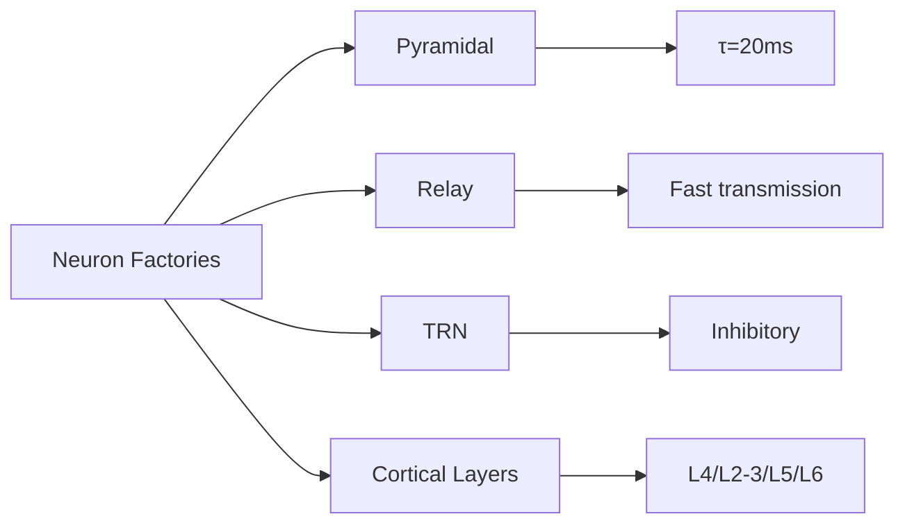

# Neuron Factories Reference

> **Auto-generated documentation** - Do not edit manually!
> Last updated: 2026-01-16 21:25:28
> Generated from: `scripts/generate_api_docs.py`

This document catalogs all neuron factory functions for creating pre-configured neuron populations with biologically-motivated parameters.

Total: **5** factory functions

  

## 💡 Why Use Neuron Factories?

Neuron factories provide:
- ✅ **Biological realism**: Parameters based on neuroscience literature
- ✅ **Consistency**: Standard configurations across the codebase
- ✅ **Customization**: Override defaults for specialized regions
- ✅ **Documentation**: Clear intent (pyramidal vs interneuron vs relay)

## 🔬 Neuron Type Comparison



## 📚 Factory Functions

### [``create_cortical_layer_neurons()``](../../src/thalia/components/neurons/neuron_factory.py) 🟢 Simple

**Returns**: `ConductanceLIF`
**Source**: [`thalia/components/neurons/neuron_factory.py`](../../src/thalia/components/neurons/neuron_factory.py)

**Description**: Create layer-specific cortical neurons.

**Parameters**:

| Parameter | Type | Default | Description |
|-----------|------|---------|-------------|
| `n_neurons` | `int` | `—` | |
| `layer` | `str` | `—` | |
| `device` | `torch.device` | `—` | |

**Examples**:

```python
>>> l6b = create_cortical_layer_neurons(16, "L6b", device)
```

---

### [``create_fast_spiking_neurons()``](../../src/thalia/components/neurons/neuron_factory.py) 🟢 Simple

**Returns**: `ConductanceLIF`
**Source**: [`thalia/components/neurons/neuron_factory.py`](../../src/thalia/components/neurons/neuron_factory.py)

**Description**: Create fast-spiking interneuron population (parvalbumin+).

**Parameters**:

| Parameter | Type | Default | Description |
|-----------|------|---------|-------------|
| `n_neurons` | `int` | `—` | |
| `device` | `torch.device` | `—` | |

**Examples**:

```python
>>> fsi = NeuronFactory.create("fast_spiking", n_neurons=20, device="cpu")
```

---

### [``create_pyramidal_neurons()``](../../src/thalia/components/neurons/neuron_factory.py) 🟢 Simple

**Returns**: `ConductanceLIF`
**Source**: [`thalia/components/neurons/neuron_factory.py`](../../src/thalia/components/neurons/neuron_factory.py)

**Description**: Create standard pyramidal neuron population.

**Parameters**:

| Parameter | Type | Default | Description |
|-----------|------|---------|-------------|
| `n_neurons` | `int` | `—` | |
| `device` | `torch.device` | `—` | |

**Examples**:

```python
>>> l23_neurons = create_pyramidal_neurons(
    ...     256, device, adapt_increment=0.3, tau_adapt=150.0
    ... )
```

---

### [``create_relay_neurons()``](../../src/thalia/components/neurons/neuron_factory.py) 🟢 Simple

**Returns**: `ConductanceLIF`
**Source**: [`thalia/components/neurons/neuron_factory.py`](../../src/thalia/components/neurons/neuron_factory.py)

**Description**: Create thalamic relay neuron population.

**Parameters**:

| Parameter | Type | Default | Description |
|-----------|------|---------|-------------|
| `n_neurons` | `int` | `—` | |
| `device` | `torch.device` | `—` | |

**Examples**:

```python
>>> matrix_relay = create_relay_neurons(32, device, v_threshold=0.9)
```

---

### [``create_trn_neurons()``](../../src/thalia/components/neurons/neuron_factory.py) 🟢 Simple

**Returns**: `ConductanceLIF`
**Source**: [`thalia/components/neurons/neuron_factory.py`](../../src/thalia/components/neurons/neuron_factory.py)

**Description**: Create thalamic reticular nucleus (TRN) inhibitory neuron population.

**Parameters**:

| Parameter | Type | Default | Description |
|-----------|------|---------|-------------|
| `n_neurons` | `int` | `—` | |
| `device` | `torch.device` | `—` | |

**Examples**:

```python
>>> trn_neurons = create_trn_neurons(32, device)
```

---

## Usage Patterns

### Simple Usage

```python
from thalia.components.neurons import create_pyramidal_neurons

# Create standard pyramidal neurons
neurons = create_pyramidal_neurons(
    n_neurons=128,
    device=device
)
```

### Custom Configuration

```python
from thalia.components.neurons import create_pyramidal_neurons

# Override defaults for specialized regions
ca3_neurons = create_pyramidal_neurons(
    n_neurons=32,
    device=device,
    adapt_increment=0.1,  # Strong adaptation for CA3
    tau_adapt=100.0,
)
```

### Layer-Specific Neurons

```python
from thalia.components.neurons import create_cortical_layer_neurons

# Create neurons for specific cortical layers
l4 = create_cortical_layer_neurons(512, "L4", device)
l23 = create_cortical_layer_neurons(256, "L2/3", device)
l5 = create_cortical_layer_neurons(128, "L5", device)
```

### Registry-Based Creation (NEW)

```python
from thalia.components.neurons import NeuronFactory

# Dynamic neuron creation by type name
pyramidal = NeuronFactory.create("pyramidal", n_neurons=100, device=device)
relay = NeuronFactory.create("relay", n_neurons=64, device=device)
l23 = NeuronFactory.create("cortical_layer", 256, device, layer="L2/3")

# List available types
available = NeuronFactory.list_types()
print(available)  # ['cortical_layer', 'pyramidal', 'relay', 'trn']

# Check if type exists
if NeuronFactory.has_type("pyramidal"):
    neurons = NeuronFactory.create("pyramidal", 100, device)
```

## See Also

- [CONSTANTS_REFERENCE.md](CONSTANTS_REFERENCE.md) - Biological constants used by factories
- [CONFIGURATION_REFERENCE.md](CONFIGURATION_REFERENCE.md) - Neuron configuration classes
- [COMPONENT_CATALOG.md](COMPONENT_CATALOG.md) - Regions using these neurons
