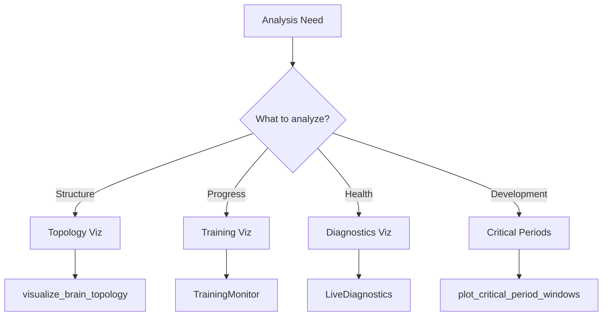

# Visualization Functions Reference

> **Auto-generated documentation** - Do not edit manually!
> Last updated: 2026-01-16 21:25:28
> Generated from: `scripts/generate_api_docs.py`

This document catalogs all visualization and plotting functions for analyzing brain topology, training progress, and diagnostic metrics.

Total: **9** visualization functions

  

## 📋 Quick Reference by Use Case

| Use Case | Functions | Purpose |
|----------|-----------|----------|
| **Topology** | 3 | Network structure visualization |
| **Training** | 1 | Training progress monitoring |
| **Diagnostics** | 1 | Real-time health metrics |
| **Critical Periods** | 4 | Developmental windows |

## 📊 Visualization Workflow



## 🧠 Network Topology Visualization

### [``export_topology_to_graphviz()``](../../src/thalia/visualization/network_graph.py#L224)

**Returns**: `None`  
**Source**: [`thalia/visualization/network_graph.py`](../../src/thalia/visualization/network_graph.py)

**Description**: Export brain topology to Graphviz DOT format.

**Parameters**:

| Parameter | Type | Default |
|-----------|------|----------|
| `brain` | `Any` | `-` |
| `output_path` | `str` | `-` |
| `include_weights` | `bool` | `True` |

**Examples**:

```python
>>> # Then render with: dot -Tpng -O topology.dot
```

---

### [``plot_connectivity_matrix()``](../../src/thalia/visualization/network_graph.py#L271)

**Returns**: `None`  
**Source**: [`thalia/visualization/network_graph.py`](../../src/thalia/visualization/network_graph.py)

**Description**: Plot connectivity matrix heatmap.

**Parameters**:

| Parameter | Type | Default |
|-----------|------|----------|
| `brain` | `Any` | `-` |
| `figsize` | `Tuple[int, int]` | `(12, 10)` |
| `cmap` | `str` | `'viridis'` |

---

### [``visualize_brain_topology()``](../../src/thalia/visualization/network_graph.py#L56)

**Returns**: `Any`  
**Source**: [`thalia/visualization/network_graph.py`](../../src/thalia/visualization/network_graph.py)

**Description**: Create NetworkX graph visualization of brain topology.

**Parameters**:

| Parameter | Type | Default |
|-----------|------|----------|
| `brain` | `Any` | `-` |
| `layout` | `str` | `'hierarchical'` |
| `figsize` | `Tuple[int, int]` | `(16, 12)` |
| `node_size_scale` | `float` | `DEFAULT_NODE_SIZE_SCALE` |
| `show_weights` | `bool` | `True` |
| `title` | `Optional[str]` | `None` |

**Examples**:

```python
>>> plt.savefig('brain_topology.png', dpi=300)
```

---

## 📈 Training Progress Visualization

### [``quick_monitor()``](../../src/thalia/training/visualization/monitor.py#L444)

**Returns**: `None`  
**Source**: [`thalia/training/visualization/monitor.py`](../../src/thalia/training/visualization/monitor.py)

**Description**: Quick monitoring function - shows all info.

**Parameters**:

| Parameter | Type | Default |
|-----------|------|----------|
| `checkpoint_dir` | `str` | `-` |

---

## 🔬 Diagnostic Monitoring

### [``quick_diagnostics()``](../../src/thalia/training/visualization/live_diagnostics.py#L504)

**Returns**: `None`  
**Source**: [`thalia/training/visualization/live_diagnostics.py`](../../src/thalia/training/visualization/live_diagnostics.py)

**Description**: Quick diagnostics display.

**Parameters**:

| Parameter | Type | Default |
|-----------|------|----------|
| `brain` | `Any` | `-` |
| `step` | `int` | `0` |

---

## 🌱 Critical Period Analysis

### [``plot_critical_period_timeline()``](../../src/thalia/training/visualization/critical_period_plots.py#L116)

**Returns**: `Figure`  
**Source**: [`thalia/training/visualization/critical_period_plots.py`](../../src/thalia/training/visualization/critical_period_plots.py)

**Description**: Plot critical period timeline showing early/peak/late phases.

**Parameters**:

| Parameter | Type | Default |
|-----------|------|----------|
| `gating` | `Optional[CriticalPeriodGating]` | `None` |
| `figsize` | `tuple` | `(14, 6)` |

---

### [``plot_critical_period_windows()``](../../src/thalia/training/visualization/critical_period_plots.py#L20)

**Returns**: `Figure`  
**Source**: [`thalia/training/visualization/critical_period_plots.py`](../../src/thalia/training/visualization/critical_period_plots.py)

**Description**: Plot all critical period windows over training timeline.

**Parameters**:

| Parameter | Type | Default |
|-----------|------|----------|
| `max_steps` | `int` | `500000` |
| `gating` | `Optional[CriticalPeriodGating]` | `None` |
| `figsize` | `tuple` | `(14, 8)` |

---

### [``plot_domain_status()``](../../src/thalia/training/visualization/critical_period_plots.py#L240)

**Returns**: `Figure`  
**Source**: [`thalia/training/visualization/critical_period_plots.py`](../../src/thalia/training/visualization/critical_period_plots.py)

**Description**: Plot detailed status for a specific domain over training.

**Parameters**:

| Parameter | Type | Default |
|-----------|------|----------|
| `domain` | `str` | `-` |
| `training_history` | `List[Dict]` | `-` |
| `gating` | `Optional[CriticalPeriodGating]` | `None` |
| `figsize` | `tuple` | `(12, 6)` |

---

### [``plot_training_metrics_with_critical_periods()``](../../src/thalia/training/visualization/critical_period_plots.py#L299)

**Returns**: `Figure`  
**Source**: [`thalia/training/visualization/critical_period_plots.py`](../../src/thalia/training/visualization/critical_period_plots.py)

**Description**: Plot training metrics alongside critical period status.

**Parameters**:

| Parameter | Type | Default |
|-----------|------|----------|
| `training_history` | `List[Dict]` | `-` |
| `metrics_to_plot` | `List[str]` | `-` |
| `gating` | `Optional[CriticalPeriodGating]` | `None` |
| `figsize` | `tuple` | `(14, 10)` |

---

## Usage Patterns

### Quick Topology Visualization

```python
from thalia.visualization.network_graph import visualize_brain_topology

# Create topology visualization
fig = visualize_brain_topology(
    brain=brain,
    layout='hierarchical',
    show_weights=True
)
fig.savefig('brain_topology.png')
```

### Training Progress Monitoring

```python
from thalia.training.visualization import TrainingMonitor

# Monitor training from checkpoints
monitor = TrainingMonitor(checkpoint_dir='checkpoints/my_run')
monitor.display_all()  # Shows progress, metrics, and growth
```

### Real-Time Diagnostics

```python
from thalia.training.visualization.live_diagnostics import LiveDiagnostics

# Create live diagnostic dashboard
diagnostics = LiveDiagnostics(brain, update_interval=10)
diagnostics.start()  # Auto-refreshing dashboard

# Training loop
for step in range(num_steps):
    loss = train_step(brain, batch)
    diagnostics.update(step, loss)
```

### Critical Period Analysis

```python
from thalia.training.visualization.critical_period_plots import (
    plot_critical_period_windows,
    plot_sensory_critical_periods
)

# Visualize developmental windows
fig1 = plot_critical_period_windows(max_steps=500000)
fig2 = plot_sensory_critical_periods(modality='visual')
```

## See Also

- [DIAGNOSTICS_REFERENCE.md](DIAGNOSTICS_REFERENCE.md) - Diagnostic monitor classes
- [USAGE_EXAMPLES.md](USAGE_EXAMPLES.md) - More visualization examples
- [../MONITORING_GUIDE.md](../MONITORING_GUIDE.md) - Complete monitoring guide

